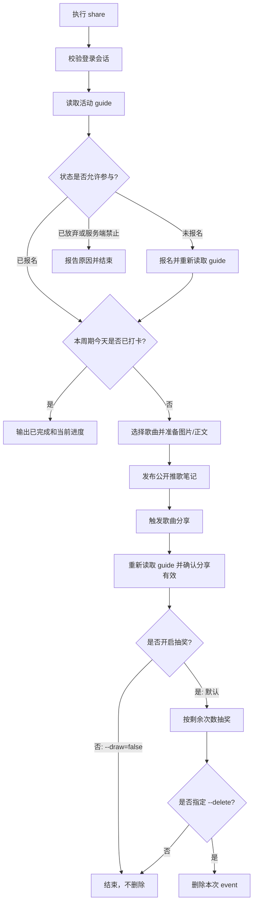

# PRD: ncmctl 每日推歌挑战赛

- 最后更新: 2026-08-20
- 模块: ncmctl CLI（`internal/ncmctl`）与每日推歌活动 API（`api/eapi`）
- 状态: 草案，待实现前确认协议兼容性

## 1. 背景与目标

网易云音乐「每日推歌挑战赛」是面向全体用户的常驻活动，以自然周（周一至周日）为一个活动周期。用户报名后，每天发布一条符合要求的推歌笔记即可完成打卡：正文至少 10 个字、至少 1 张图片、携带单曲资源，并在活动周期内保持公开可见。每日合格打卡获得 1 次抽奖机会；单周累计打卡满 2 天额外获得 1 次抽奖机会；自然周 7 天全勤可获得全勤奖励。抽奖次数在周期结束后清零。

当前仓库已经有活动所需的报名、周期报名、进度查询、笔记发布、分享触发和抽奖接口，但还没有 CLI 编排。用户需要手动进入 App 报名、选歌、准备图片、发布笔记和抽奖，容易重复发布或漏掉周期状态。

本需求提供一个一次性执行的 `ncmctl share` 命令：复用现有登录会话和 API 类型，由服务端进度作为唯一事实源，完成一次合规推歌打卡并默认抽奖；用户可通过命令行参数关闭抽奖或在抽奖完成后清理本次动态。

### 1.1 目标

- 提供活动状态查询、首次报名/周期报名和一次推歌打卡的 CLI 流程。
- 默认从现有「每日推荐歌曲」接口选择一首歌，也允许用户指定歌曲 ID。
- 默认使用歌曲封面作为笔记图片，也允许用户指定一张本地图片。
- 在发布前读取活动进度；本周期已经完成打卡时直接跳过，不重复发布。
- 发布成功后调用分享触发接口，并重新读取进度确认服务端状态；需要时在同一执行链完成抽奖后删除本次刚发布的动态。
- 提供单独的抽奖入口，按服务端实际剩余次数抽奖，不硬编码奖品内容或活动 ID。
- 接入现有 `ncmctl task` 长期调度器，支持按 cron 每日执行推歌、抽奖和可选的抽奖后删除。
- 输出清晰的成功、跳过、部分成功和失败结果，不在本地伪造活动进度。

### 1.2 非目标

- 不实现多账号队列、独立 Cookie 文件参数或青龙式批量任务；当前 CLI 使用全局 `--home`/`--config` 选择一个运行会话。
- 不实现独立于现有 `ncmctl task` 的新调度服务；任务调度复用现有 cron、时区、登录和错误日志机制。
- 不默认删除已发布笔记。通过 `--delete` 可在同一执行链完成分享确认和抽奖后删除本次刚发布的动态；不允许删除历史动态或其他 event。
- 不自动领取实物、云贝、会员卡或其他奖品；只展示服务端返回的奖励信息和领取链接。
- 不添加与活动无关的乐迷团、音乐合伙人话题，也不复制参考仓库中的硬编码话题列表。
- 不绕过风控、验证码、设备校验或社区内容审核，不保证网易云音乐一定接受自动化发布。
- 不复刻官方 H5 页面；CLI 只提供文本状态和操作结果。

## 2. 用户故事(User story)

### US-001: 查看本周活动状态

**描述:** 用户想在终端确认当前是否已报名、本周已打卡几天、还有多少抽奖机会，以及全勤奖励是否已经具备领取条件。
**验收标准:**

- [ ] `ncmctl share status` 只读取活动状态，不报名、不发布、不抽奖。
- [ ] 输出活动周期、报名状态、已发布笔记数、已获得和已使用的抽奖次数。
- [ ] 输出服务端返回的 `rewardJumpUrl`（存在时）和当前周期 ID；不输出 Cookie、Token 或完整请求体。

### US-002: 完成一次每日推歌打卡

**描述:** 用户已经登录，希望用一条命令完成当天的一次合规推歌笔记发布。
**验收标准:**

- [ ] 未报名时命令先完成必要的活动报名，再继续执行；已报名时不重复创建无意义的报名请求。
- [ ] 发布请求同时包含单曲资源、至少一张图片、长度不少于 10 个 Unicode 字符的正文，并明确设置为公开可见。
- [ ] 发布成功后调用分享触发接口，并重新查询进度。
- [ ] 已完成本周期当日打卡时命令成功退出并报告“已完成”，不再创建第二条笔记。

### US-003: 控制歌曲和图片

**描述:** 用户希望使用自己选定的歌曲或图片，而不是完全依赖随机选择。
**验收标准:**

- [ ] `--song-id` 指定有效歌曲 ID 时，使用该歌曲，不再调用每日推荐列表选择歌曲。
- [ ] 未指定 `--image` 时使用选中歌曲的专辑封面；指定后使用本地图片并在发布前完成上传。
- [ ] 歌曲、图片或正文校验失败时，不发送发布请求。

### US-004: 在周期结束前使用抽奖机会

**描述:** 用户希望在终端使用已经获得的活动抽奖次数，避免周期结束清零；一次推歌发布默认会继续执行抽奖。
**验收标准:**

- [ ] `ncmctl share draw` 使用活动进度返回的活动兴趣 ID和剩余次数。
- [ ] 默认发布流程执行抽奖；传入 `--draw=false` 时跳过抽奖且不删除动态。
- [ ] 无抽奖机会时不调用抽奖接口并给出明确提示。
- [ ] 每次抽奖都输出奖品名称（有返回时）和剩余次数；遇到网络错误后停止，不自动重试未知结果。

### US-005: 处理发布后的异常

**描述:** 用户担心发布已经成功但后续触发或状态查询失败时，命令重复发布造成违规或重复打卡。
**验收标准:**

- [ ] 发布接口返回成功后，即使后续触发或刷新进度失败，也输出已生成的 event ID。
- [ ] 后续失败以部分成功/失败结果返回，但不删除笔记、不自动再次发布。
- [ ] 用户再次运行命令时，以服务端状态判断是否已经打卡。

### US-006: 抽奖后清理本次动态

**描述:** 用户希望获得本次打卡对应的抽奖机会后清理个人主页，但不希望动态在抽奖前被删除。
**验收标准:**

- [ ] 删除默认关闭；不传 `--delete` 时，发布和抽奖完成后不调用删除接口。
- [ ] 只有在同一执行链中发布成功、分享触发成功、状态确认完成且至少一次抽奖请求成功后，才允许删除本次返回的 event ID。
- [ ] 抽奖失败、抽奖结果未知、没有可用抽奖次数、状态确认失败或 event ID 无效时不删除动态。
- [ ] 删除失败时保留并输出 event ID，作为部分成功处理，不自动删除其他动态或重复发布。

### US-007: 通过 task 自动执行每日推歌

**描述:** 用户希望把每日推歌加入 ncmctl 已有的长期任务服务，按固定时间自动完成当天打卡，而不需要另行维护系统 cron。
**验收标准:**

- [ ] `ncmctl task --share` 注册每日推歌任务，并使用独立的 `--share.cron` 调度表达式。
- [ ] 任务执行复用一次性发布命令的报名、幂等、发布、触发、抽奖和可选删除流程，不复制第二套业务逻辑。
- [ ] `--share.delete` 默认关闭；task 默认抽奖，只有显式传入 `--share.draw=false` 时才关闭抽奖。
- [ ] 任务失败只记录当前任务错误并等待下一次调度，不在同一调度周期自动重发已成功发布的动态。
- [ ] 不带任何任务选择器且未指定 `--runAll` 时，`ncmctl task` 直接报错要求至少选择一个任务，不再默认注册三项；显式 `--runAll` 注册包含每日推歌在内的全部四项任务。

## 3. 功能需求

整体流程如下：

`share draw` 仍用于已存在的活动抽奖机会，但没有本次新发布的 event ID，因此不能与删除动作绑定。

长期调度通过 `ncmctl task --share` 调用默认发布流程；调度器不直接调用活动 API，也不绕过一次性命令的安全校验。

### FR-01: [P0]-命令与执行模式

提供以下命令：

- `ncmctl share`：执行报名检查、一次推歌发布、分享触发、进度确认和抽奖。
- `ncmctl share --draw=false`：执行发布流程但跳过抽奖；此模式不能使用 `--delete`。
- `ncmctl share status`：只查询并展示当前活动状态。
- `ncmctl share draw`：只查询状态并使用当前活动剩余抽奖次数，不发布笔记。

发布命令支持以下参数：

| 参数 | 默认值 | 说明 |
| --- | --- | --- |
| `--song-id` | 空 | 指定歌曲 ID；为空时从每日推荐歌曲中随机选择 |
| `--image` | 空 | 本地图片路径；为空时下载并使用歌曲专辑封面 |
| `--title` | `今日推荐：<歌曲名>` | 笔记标题 |
| `--message` | `分享一首今天听到的好歌，欢迎一起听听。` | 笔记正文，必须至少 10 个 Unicode 字符 |
| `--draw` | `true` | 是否在发布成功后于同一执行链使用本次活动抽奖机会；传 `--draw=false` 关闭 |
| `--delete` | `false` | 抽奖成功后删除本次刚发布的动态；要求抽奖保持开启 |
| `--dry-run` | `false` | 只读取状态并准备歌曲/正文，不报名、不上传图片、不发布 |

发布与 `draw` 流程均支持 `--count`，默认使用服务端报告的全部剩余次数，取值范围为 1 至 8。8 次上限来自官方规则的“每日最多 1 次 × 7 天 + 单周额外 1 次”，同时作为异常响应下的安全阈值。

**前置条件**

- 已通过现有登录流程建立有效 Cookie。
- `root.Cfg.Network` 已由根命令按 `--home` 和 `--config` 初始化。
- 发布流程需要网络访问网易云音乐 API；状态命令同样需要登录会话。

**交互说明**

- 命令帮助必须明确说明：发布会修改账号动态，默认执行抽奖且笔记默认保持公开；`--draw=false` 可关闭抽奖，`--delete` 只在抽奖完成后删除本次动态。
- `status` 和 `draw` 必须与发布命令分开，避免用户只想查看状态时产生写操作。
- `--delete` 与 `--draw=false` 同时使用时快速失败，不删除动态。
- `--dry-run` 不得调用任何会改变活动状态的接口。

**规则边界限制**

- 不接受位置参数；歌曲通过 `--song-id` 指定。
- `--song-id` 必须是正整数；`--count` 必须在 1 至 8 之间。
- `--image` 必须是存在的常规文件；不接受目录、符号链接或空文件。
- `--message` 去除首尾空白后少于 10 个 Unicode 字符时快速失败。
- `--delete` 只能用于默认发布命令，不能用于 `status` 或独立 `draw` 子命令；`--draw` 必须为 `true`。

### FR-02: [P0]-登录与活动状态

使用现有 `api.NewClient`、`weapi.GetUserInfo` 和 `eapi` 客户端完成会话检查。不能新建第二套 Cookie、设备或运行目录管理。

**业务流程**

1. 创建 API Client。
2. 调用 `GetUserInfo` 确认账号有效，输出昵称或用户 ID，不输出 Cookie 值。
3. 调用 `DailySongShareRegistrationGuide` 获取活动状态。
4. 使用 `RegisterStatus`、`ActivityId`、`ActivityCycleId`、`ActivityInterestId` 和 `RegisteredGuide` 作为服务端事实源。

**状态说明**

- `AlreadyPubEvent=true` 或服务端明确表示本周期已有合格发布时，视为本次已完成。
- `PubEventCount` 用于展示周期进度，不在客户端自行推算自然日。
- 未知的 `RegisterStatus` 不得被当作已报名或可发布，命令应报告原始状态并停止。
- 服务端表示用户已放弃或本周期不可再次报名时，命令只展示原因并结束；不得尝试绕过限制。

### FR-03: [P0]-报名与周期报名

复用 `api/eapi/daily_song_share.go` 中已有接口：

- `DailySongShareRegister`：用户尚未完成活动报名时调用。
- `DailySongShareAttendanceRegister`：guide 返回当前周期需要周期报名且提供有效 `ActivityId`、`ActivityCycleId` 时调用，`AutoRegister` 必须为 `true`。
- 报名后重新调用 `DailySongShareRegistrationGuide`，以刷新周期状态和抽奖信息。

**规则边界限制**

- 不在 CLI 中写死抽奖活动 ID、周期 ID 或奖品 ID；全部使用 guide 返回值。
- 业务响应 `Code != 200` 必须带上接口名称、code 和 message 返回错误；只有服务端明确表示“已报名”时才可继续。
- 报名成功但刷新 guide 失败时，不继续发布，避免在未知状态下重复操作。

### FR-04: [P0]-选择歌曲

优先复用当前仓库已有的 `api/weapi.RecommendSongs` 和 `api/weapi.SongDetail`，不复制参考仓库的歌单常量。

**业务流程**

1. `--song-id` 非空时调用 `SongDetail`，要求返回单曲详情和有效歌曲 ID。
2. 未指定歌曲时调用 `RecommendSongs`，从 `Data.DailySongs` 中选择一首有效歌曲。
3. 记录歌曲 ID、名称、艺术家、专辑名称和专辑封面 URL，供正文和图片准备使用。

**规则边界限制**

- 每日推荐为空、歌曲详情无结果或封面 URL 为空时，在发布前失败。
- 不因为歌曲不能下载、版权等级或播放权限而擅自替换为另一首；选歌失败应明确说明原因。
- 随机选择只影响本次候选歌曲，不写入本地状态，也不承诺跨天去重。

### FR-05: [P0]-准备合规推歌笔记

发布前必须准备一张可上传图片和一段合规正文。图片上传复用 `api/eapi.EventUploadImage`，不重复实现 NOS 上传流程。

**业务流程**

1. 指定 `--image` 时校验本地文件并上传一张图片。
2. 未指定时，使用歌曲专辑封面 URL 下载到受控临时文件，再通过 `EventUploadImage` 上传；上传完成后删除临时文件。
3. 生成标题和正文，正文按 Unicode 字符数校验至少 10 个字符。
4. 正文和标题只使用用户输入及歌曲信息，不自动追加外部话题、歌单链接或参考仓库中的话题列表。

**交互说明**

- 输出选中的歌曲和图片来源，图片来源只显示本地路径或 CDN 主机名，不显示 Cookie 等凭据。
- 图片下载设置响应大小上限并遵循命令 context；下载、上传任一步失败都不调用发布接口。

### FR-06: [P0]-发布公开笔记并触发打卡

调用 `DailySongSharePublish` 发布带单曲资源的公开笔记。CLI 负责提供歌曲 ID、用户 ID、标题、正文和上传后的 `Pics`；API 层负责已有的 XEAPI 选项、默认字段和活动发布请求头。

发布请求必须满足：

- `Type` 为 `song`，`Id`、`ThreadId`、`ResourceId` 与歌曲 ID 对应。
- `Uid` 为当前登录用户 ID。
- `Pics` 至少包含一张已上传图片。
- `PrivacySetting` 为公开值，`SocialSpaceVisible` 为可见值。
- 默认不删除动态；只有显式指定 `--delete` 且后续抽奖成功时，才进入 FR-09 的删除步骤。

发布返回成功后调用 `DailySongShareTrigger`，歌曲 ID使用同一首歌，渠道使用接口默认的 `cloudmusic`。触发失败时返回带 event ID 的部分成功错误，不自动重发，也不删除动态。

**其他**

当前接口中的 `ActivityInfoList` 不得填入参考仓库的无关话题。是否需要活动专属关联字段，必须先用当前接口的固定输入/输出或经过授权的移动端请求证据确认；若服务端确实要求，应在 API 层增加有名称、有测试的当前活动字段，而不是在 CLI 中散落硬编码 JSON。

### FR-07: [P0]-状态确认与幂等

发布或触发成功后再次调用 `DailySongShareRegistrationGuide`。

- 刷新结果显示已发布时，输出“本周期打卡完成”、event ID、已打卡天数/笔记数和抽奖进度。
- 刷新失败时保留 event ID，并明确提示用户运行 `status` 检查，不自动再次发布。
- 下次执行发布命令时，若 guide 已显示本周期完成，则跳过歌曲选择、图片上传和发布。
- 客户端不保存“今天是否发布”的本地标记；服务端状态优先，避免本地状态与账号实际状态分叉。
- guide 已显示本周期完成时，本次没有新 event ID，`--delete` 不得删除任何已有动态。

### FR-08: [P1]-抽奖

`draw` 子命令只处理活动抽奖，不发布新笔记。

发布命令默认在发布和状态确认之后复用同一抽奖流程；只有保持 `--draw=true` 的同一执行链抽奖结果才可以触发 FR-09 的删除步骤。传入 `--draw=false` 时直接结束发布流程。

**业务流程**

1. 读取 guide；未报名、`ActivityInterestId` 缺失或服务端明确不可抽奖时停止。
2. 以服务端返回的剩余次数为准，使用 `RewardCount - HaveRewardCount` 计算候选次数，并取 `--count` 的上限。
3. 调用 `DailySongShareLottery`，每次使用 guide 返回的 `ActivityInterestId`。
4. 以返回的 `RestChance` 作为下一次是否继续的依据；返回 0 时立即停止。
5. 输出奖品名称、中奖描述、领取链接（若服务端返回）和剩余次数。

**规则边界限制**

- 没有次数时不调用抽奖接口。
- 抽奖请求发生传输错误或返回未知结果时立即停止，不自动重试，避免重复消费次数。
- 不把奖品名称、奖品 ID、领取时限写死在 CLI 中；奖品池以服务端实际返回为准。
- 全勤奖励不是抽奖；只展示 guide 的奖励提示和 `RewardJumpUrl`，不假设存在可调用的领取接口。

### FR-09: [P1]-抽奖后可选删除本次动态

`--delete` 默认值为 `false`。它只删除本次 `DailySongSharePublish` 成功返回的 event ID，不接受用户传入任意 event ID。

**前置条件**

- 当前执行链使用默认发布命令，抽奖保持开启（默认 `--draw=true`），并指定 `--delete`。
- 发布接口返回 `Code=200` 且 event ID 为正数。
- `DailySongShareTrigger` 返回成功，发布后的 guide 已完成状态确认。
- 至少一次 `DailySongShareLottery` 返回成功结果；如果 guide 显示没有抽奖机会、抽奖失败或结果未知，则保持动态公开，不删除。

**业务流程**

1. 发布成功后保存 event ID，后续所有步骤都不得丢失该 ID。
2. 保持动态有效，先完成分享触发、状态确认和抽奖。
3. 抽奖成功后调用 `api/eapi.EventDelete`，请求只使用本次 event ID。
4. 删除返回成功时输出“抽奖完成，动态已删除”；删除失败时输出 event ID并返回部分成功错误，动态保持不变。

**规则边界限制**

- 删除请求必须发生在最后一次抽奖请求返回之后，不能提前、并发或插入发布流程。
- 不因删除失败而重发笔记，不尝试删除历史 event。
- 独立 `share draw` 没有本次发布 event，不支持 `--delete`。
- 删除动态可能使用户失去“所有打卡笔记全程公开”的全勤奖励资格；命令帮助和 task 注册日志必须明确提示这一影响。

### FR-10: [P0]-错误、日志和结果输出

结果至少区分以下情况：

- 成功：完成打卡，或完成状态查询/抽奖。
- 跳过：本周期已经打卡、没有抽奖次数、活动暂不可参与。
- 部分成功：笔记已发布但分享触发或状态确认失败，必须带 event ID。
- 部分成功：笔记和抽奖已完成但删除失败，必须带 event ID，并说明动态仍然保留。
- 失败：登录、报名、选歌、图片上传、发布或抽奖接口明确失败。

错误必须包含操作名称和服务端 `code/message`（有返回时）。不得吞掉错误，不得把业务失败伪装成网络成功。日志遵循根命令的敏感信息提示，正常输出不包含 Cookie、anti-cheat token、设备 ID 或完整加密请求体。

### FR-11: [P0]-接入 task 长期调度

将每日推歌作为现有 `ncmctl task` 的一个可选任务，不新建调度器或第二套执行入口。

**命令与参数**

| 参数 | 默认值 | 说明 |
| --- | --- | --- |
| `--share` | `false` | 注册每日推歌任务 |
| `--share.cron` | `0 9 * * *` | 五段式 cron；默认每天 09:00 执行（`[Assumption]`，使用 task 的 `--location` 时区） |
| `--share.song-id` | 空 | 每次任务固定使用的歌曲 ID；为空时使用每日推荐 |
| `--share.image` | 空 | 每次任务使用的本地图片；为空时使用歌曲封面 |
| `--share.title` | 空 | 覆盖一次性命令标题；为空时使用一次性命令默认标题 |
| `--share.message` | 空 | 覆盖一次性命令正文；为空时使用一次性命令默认正文 |
| `--share.draw` | `true` | 是否在发布后于同一任务执行中抽奖；传 `--share.draw=false` 关闭 |
| `--share.delete` | `false` | 抽奖成功后删除本次动态；要求 `draw` 保持开启 |

**任务选择规则**

- `ncmctl task` 不带任何任务选择器且未指定 `--runAll` 时直接报错，要求至少选择一个任务；不因误用自动发布公开笔记。
- `ncmctl task --share` 注册每日推歌；可与其他任务选择器组合。
- `ncmctl task --runAll` 明确注册四项内置任务，包括每日推歌。
- `--share.delete` 与 `--share.draw=false` 同时使用时，在启动 cron 前快速失败。
- `--share.dry-run` 不提供给 task；长期任务必须执行真实状态检查和业务流程，预览使用一次性命令。

**业务流程**

1. `Task.validate` 在启动 cron 前校验每日推歌 cron 和抽奖/删除参数的组合关系。
2. `Task.execute` 使用现有 `--location` 加载 cron 时区，并通过与其他任务相同的注册机制加入每日推歌任务。
3. 调度触发时创建一次性每日推歌命令实例，复制任务参数后执行其默认发布流程；不得在 `task.go` 中重新编排活动 API。
4. 任务错误写入现有 scheduler 日志并结束本次执行；下一次 cron 到点后重新读取服务端状态。发布成功后的 trigger、lottery 或 delete 错误不得触发同一轮自动重发。

**交互说明**

- `task --help` 必须说明每日推歌会发布公开动态，默认抽奖且不删除；传入 `--share.draw=false` 可关闭抽奖，启用删除时不得关闭抽奖，并可能影响全勤奖励资格。
- 任务注册时输出每日推歌的下一次执行时间，沿用现有任务日志格式。
- `--runAll` 的帮助必须明确包含每日推歌；不带选择器且不带 `--runAll` 必须快速失败并提示至少选择一个任务，避免用户误以为会自动发布。

## 4. 产品方案

| 方案 | 优点 | 缺点 | 结论 |
| --- | --- | --- | --- |
| 基于现有 API 的一次性 CLI 编排，并接入现有 task 调度 | 代码范围小；与当前 `--home`、Cookie、API Client 和 cron 生命周期一致；重复执行可安全跳过 | 真实账号行为仍受服务端风控影响；任务会长期运行 | 采用 |
| 新增独立活动配置、多账号队列和内置调度 | 适合长期批量运行 | 引入新的配置模型、账号隔离和调度边界，扩大首版风险；参考实现的多账号逻辑也不适用于当前 CLI | 本期不采用 |
| 仅依赖外部 cron 调用一次性命令 | 不需要改 task | 用户需要维护第二套调度；错误、时区和登录生命周期不能复用 ncmctl | 不采用 |
| 发布后立即删除笔记 | 能保持个人主页整洁 | 可能在抽奖前使动态失效，导致本次打卡无法获得抽奖机会 | 放弃 |
| 通过参数在抽奖后删除本次动态 | 满足清理需求；默认不改变现有公开状态；删除对象和时序可验证 | 抽奖或删除失败时需要保留动态并报告部分成功 | 采用 |
| 复制参考仓库的固定歌单、话题、anti-cheat 参数和 EAPI/iOS 分支 | 初期看似接近可运行 | 这些值与当前仓库 API/客户端契约不一致，且会把无关话题和过期协议带入当前实现 | 禁止 |

关键决策：

1. **服务端状态优先。** 活动周期、报名状态、打卡状态、抽奖次数和活动 ID均从 guide 获取。
2. **发布动作一次且可追踪。** 发布成功后不重发；默认不删除，只有抽奖成功后才可按参数删除本次 event，后续异常通过 event ID 和 `status` 恢复判断。
3. **把合规约束放在发布前。** 图片、单曲资源、公开设置和正文长度在调用发布 API 前检查。
4. **只复用当前仓库能力。** 选歌使用 `RecommendSongs`/`SongDetail`，图片上传使用 `EventUploadImage`，不引入新依赖。
5. **删除必须后置。** 删除请求永远位于同一执行链的最后一次抽奖响应之后，抽奖失败或没有机会时不删除。
6. **任务显式启用。** `task` 不再保留无选择器默认三项的行为；`--share` 或 `--runAll` 注册每日推歌，避免升级后无提示地产生公开动态。

## 5. 非功能性需求

### 5.1 性能要求

- 使用根配置中的网络超时和 context；不使用固定 sleep 伪造 App 行为。
- 正常一次发布只应包含必要的状态、选歌、图片上传、发布、触发、确认和默认抽奖请求；传入 `--draw=false` 时跳过抽奖，启用删除参数时追加删除请求，不做并发发布。task 只在 cron 触发时执行一次，不并发重入同一任务。
- 自动封顶图片下载大小，临时文件在成功和失败路径都清理。

### 5.2 安全要求

- 发布命令明确提示会修改账号动态并保持公开。
- 不接受通过命令参数传入 Cookie 或 anti-cheat token；复用现有 Cookie 传输策略。
- 不在普通输出和错误中打印 Cookie、Token、设备标识、完整请求头或加密正文。
- 不提供 `--force` 绕过已打卡判断，不提供抽奖前删除和自动重试发布；删除只接受本次 event ID。
- task 的每日推歌默认抽奖且不开启删除；传入 `--share.draw=false` 可关闭抽奖，启用删除会在帮助和任务日志中明确提示可能失去全勤奖励资格。

### 5.3 兼容性要求

- 遵循当前 ncmctl 的 `--home`、`--config`、日志和 API Client 生命周期。
- 支持当前仓库已有的图片上传格式和 Windows/macOS/Linux 文件路径处理。
- 以当前 `api/eapi/daily_song_share.go` 的 XEAPI 方法为首版协议边界；不因参考仓库存在 EAPI/iOS 分支而自动扩展协议。

### 5.4 可用性要求

- 活动状态输出使用服务端字段，并同时展示原始状态含义，便于规则变化后排查。
- 发生发布、抽奖或删除异常时给出 `event ID` 和下一步 `status` 命令；删除失败时明确说明动态仍然保留。
- 服务端没有抽奖活动 ID或返回未知状态时安全停止，不使用过期常量继续请求。
- task 仅记录单次任务错误并等待下一次 cron，不因一次失败修改调度器状态或进入紧密重试。

## 6. 验收指标

| 场景 ID | 验收点 | 前置条件(Given) | 触发动作(When) | 预期结果(Then) |
| --- | --- | --- | --- | --- |
| AC-001 | 命令注册与帮助 | 已构建 ncmctl | 执行 `ncmctl share --help` | 帮助包含登录要求、公开发布副作用、默认抽奖、`--draw=false`、默认不删除、抽奖后删除参数和参数约束 |
| AC-002 | 未登录 | Cookie 无有效用户会话 | 执行发布命令 | 在发布前失败，提示需要登录，不调用发布、上传或抽奖接口 |
| AC-003 | 只读状态 | fake transport 返回 guide | 执行 `share status` | 只调用用户信息/guide 读取路径，不调用报名、发布、触发、上传或抽奖路径 |
| AC-004 | 首次报名 | guide 表示未报名且返回活动/周期 ID | 执行发布命令 | 完成必要报名并刷新 guide，然后进入发布流程 |
| AC-005 | 随机选歌发布 | guide 允许参与，推荐接口返回歌曲 | 执行发布命令 | 发布请求包含一首推荐歌曲、至少一张图片、正文不少于 10 个 Unicode 字符，且为公开可见 |
| AC-006 | 指定歌曲和图片 | 指定有效 `--song-id` 与本地图片 | 执行发布命令 | 使用指定歌曲和图片；推荐列表不被调用；图片上传失败时不发布 |
| AC-007 | 重复执行幂等 | guide 表示本周期已打卡 | 再次执行发布命令 | 成功跳过，不调用歌曲选择、图片上传和发布接口 |
| AC-008 | 发布后触发失败 | publish 返回成功，trigger 返回错误 | 执行发布命令 | 输出 event ID 和部分成功错误；不删除、不重发；提示运行 `status` |
| AC-009 | 周期全勤信息 | guide 返回 7 天进度和奖励链接 | 执行 `status` | 输出服务端全勤/领奖信息，不硬编码奖品天数，不自动领取 |
| AC-010 | 无抽奖次数 | guide 返回剩余次数为 0 | 执行 `draw` | 成功跳过，不调用 lottery |
| AC-011 | 多次抽奖 | guide 返回有限次数，lottery 逐次返回 `RestChance` | 执行 `draw --count 8` | 最多调用服务端实际剩余次数，`RestChance=0` 后停止，输出每次结果 |
| AC-012 | 抽奖未知结果 | lottery 请求传输错误 | 执行 `draw` | 立即停止并提示不要自动重试；不会继续消费可能已扣减的次数 |
| AC-013 | 临时文件清理 | 自动下载封面后在上传或发布阶段失败 | 执行发布命令 | 临时封面文件被清理，不留下运行产物 |
| AC-014 | 离线验证 | 使用 fake transport/固定响应 | 执行目标包测试、race 和 lint | 测试覆盖请求顺序、幂等分支、错误传播和敏感输出；不访问真实账号 |
| AC-015 | 默认抽奖且不删除 | 发布和抽奖均成功，但未指定删除参数 | 执行 `share` | 默认调用 lottery，不调用 `EventDelete`，动态保持公开 |
| AC-016 | 抽奖后删除 | 发布、触发、状态确认和抽奖均成功 | 执行 `share --delete` | 默认抽奖后请求顺序为 publish → trigger → guide → lottery → delete，且只删除本次 event ID |
| AC-017 | 抽奖失败不删除 | 发布成功，抽奖返回业务错误或传输错误 | 执行带删除参数的发布命令 | 停止后续流程，动态保持公开，不调用 `EventDelete` |
| AC-018 | 删除失败 | 发布和抽奖成功，删除接口失败 | 执行带删除参数的发布命令 | 返回部分成功，输出 event ID，说明动态仍然保留，不重发笔记 |
| AC-019 | task 显式注册 | 已登录，task 未指定其他选择器 | 执行 `ncmctl task --share` | 只注册每日推歌任务，使用默认 `0 9 * * *`，服务持续运行 |
| AC-020 | task 自定义调度 | 已登录 | 执行 `ncmctl task --share --share.cron '0 8 * * *' --location Asia/Shanghai` | 注册成功，任务按指定时区和 cron 执行 |
| AC-021 | task 抽奖后删除 | 每日推歌任务启用 delete，未关闭默认抽奖 | 执行 `ncmctl task --share --share.delete` | 每次任务遵循 publish → trigger → guide → lottery → delete；抽奖前不删除 |
| AC-022 | task 参数组合错误 | 显式关闭抽奖后启用 delete | 执行 `ncmctl task --share --share.draw=false --share.delete` | 在启动 cron 前失败，不注册任务、不发布动态 |
| AC-023 | task 空选择报错 | 现有用户未传任务选择器且未指定 --runAll | 执行 `ncmctl task` | 快速失败并提示至少选择一个任务，不注册任何任务 |
| AC-024 | task 全量选择 | 已登录 | 执行 `ncmctl task --runAll` | 注册四项内置任务，并在帮助/日志中明确包含每日推歌 |
| AC-025 | task 单次失败 | 调度中的每日推歌请求失败 | 到达每日推歌 cron 时间 | 记录当前任务错误，等待下一次调度；不在本轮自动重发 |
| AC-026 | 关闭默认抽奖 | 发布成功但用户不希望本次抽奖 | 执行 `share --draw=false` | 完成发布和状态确认，不调用 lottery；不允许同时删除动态 |

## 7. 风险与待决事项

| 事项 | 说明 | 状态 |
| --- | --- | --- |
| 当前 XEAPI 会话兼容性 | 需要确认当前仓库保存的 Cookie、设备状态和 `api.Client` 的 XEAPI 请求能够完成活动发布。未经用户明确授权，不运行真实账号测试。 | 待授权验证 |
| 删除与抽奖时序 | 删除过早可能使动态失效并导致抽奖机会未产生；必须通过 fake transport 验证调用顺序，并在获授权后验证服务端删除响应与抽奖结果的先后关系。 | 待协议验证 |
| task 默认调度时间 | 官方活动未规定每日发布时间；PRD 暂定 `Asia/Shanghai` 下每天 09:00，允许通过 `--share.cron` 和 `--location` 调整。 | `[Assumption]` |
| task 默认选择范围 | 为避免误用自动发布，不带选择器且不带 `--runAll` 的 task 直接报错；`--runAll` 作为显式全量选择包含每日推歌。 | 已定边界 |
| 活动关联字段 | `DailySongSharePublishReq` 有 `ActivityInfoList` 字段，但官方规则页面没有给出请求结构；必须用当前仓库协议证据确认是否需要，不能复制参考仓库的无关话题。 | 待协议验证 |
| anti-cheat 参数 | 当前 Client 会按现有 Cookie/请求策略处理相关请求头，但活动接口是否还要求请求体 `checkToken` 需要真实或固定协议证据确认。首版不新增 token 配置或命令行参数。 | 待协议验证 |
| 全勤奖励领取 | 当前活动 API 类型包含 `RewardJumpUrl`，没有明确的全勤奖励领取接口。首版只展示链接和状态，领取由用户在官方页面完成。 | 已定边界 |
| 官方文案差异 | 详细规则页写明 7 天可领取黑胶 VIP 2 日卡，主活动页只写“黑胶 VIP 奖励”，奖品池也可能更新。CLI 不硬编码奖励名称，以 guide 和官方页面实际返回为准。 | 已知风险 |
| 活动周期时间 | 规则以自然周为单位，但客户端不应根据本地时区推算完成状态；以服务端 guide 为准。 | 已定边界 |
| 外部调度 | 本期不接入 `ncmctl task`；需要每天执行的用户使用系统 cron，并自行承担账号行为风险。 | 已定边界 |

## 8. 参考

### 8.1 术语与定义

| 名词 | 说明 |
| --- | --- |
| 活动周期 | 官方定义的自然周，周一至周日；抽奖次数在周期结束后清零 |
| 推歌笔记 | 携带单曲资源、至少一张图片、正文至少 10 个 Unicode 字符且公开可见的动态 |
| guide | `DailySongShareRegistrationGuide` 返回的报名、周期、打卡和奖励状态 |
| 活动兴趣 ID | guide 返回的 `ActivityInterestId`，用于抽奖请求；不使用客户端硬编码值 |
| event ID | 发布接口返回的动态 ID，用于结果追踪和异常恢复提示 |

### 8.2 参考文档

- [每日推歌挑战赛规则说明](https://y.music.163.com/g/yida/b43648015e0c44e1936ac64eefb14625?fromRN=1)：活动对象、自然周规则、笔记标准、抽奖和全勤奖励说明。
- [每日推歌挑战赛活动页](https://y.music.163.com/g/yida/67552d649bf9453abff1668bb2ba44c7?fromRN=1)：活动入口、发布入口、规则弹窗和活动内容。
- `api/eapi/daily_song_share.go`：当前仓库的活动报名、周期报名、状态、发布、触发和抽奖接口。
- `api/eapi/event.go`：现有动态图片上传 `EventUploadImage` 和本次动态删除 `EventDelete` 能力。
- `api/weapi/recommend.go`、`api/weapi/song.go`：每日推荐歌曲和歌曲详情接口。
- `internal/ncmctl/task.go`：现有 cron 任务注册、时区、错误记录和任务选择约定。
- `internal/ncmctl/ncmctl.go`、`docs/usage.md`：CLI 命令注册、运行目录和面向用户的帮助约定。
- `testdata/3899/ncmm/internal/ncmm/daily_song_share.go`：仅作为流程和边界的逻辑参考；不得直接复制其代码、默认话题、多账号配置或自动删除逻辑。
