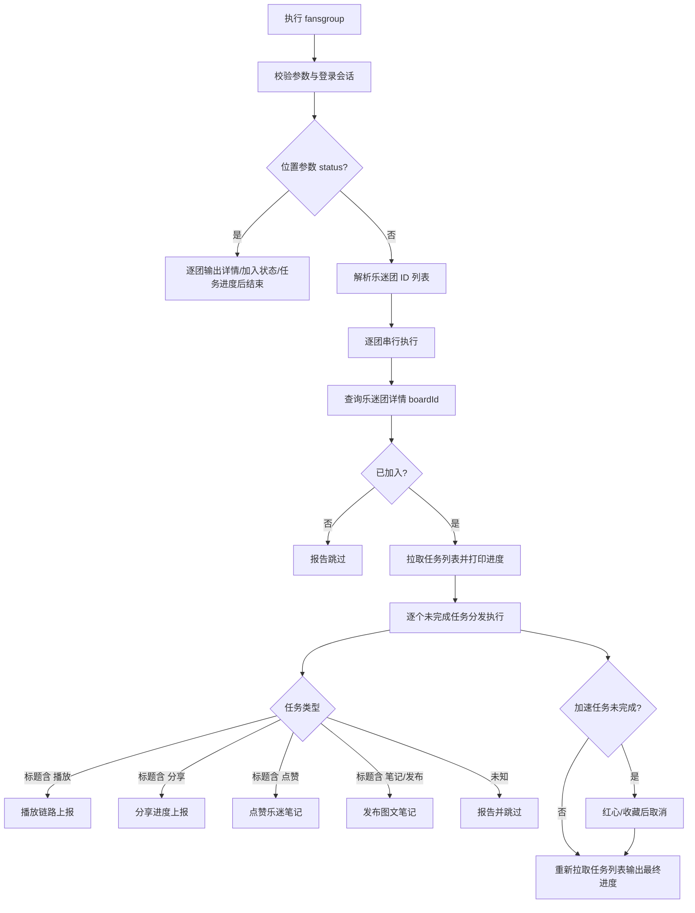

# PRD: ncmctl 乐迷团任务命令 (fansgroup)

- 最后更新: 2026-09-01
- 模块: ncmctl CLI（`internal/ncmctl`）与乐迷团 API（`api/eapi/fansgroup.go`）
- 状态: 草案，待实现前确认协议兼容性

## 1. 背景与目标

网易云音乐「乐迷团」是以歌手为单位的粉丝社区。用户加入乐迷团后，每日完成任务（播放歌曲、分享歌曲、点赞乐迷笔记、发布图文笔记、今日加速任务）可获得积分与亲密值，提升粉丝等级。任务进度以自然日为周期重置。

当前仓库已具备完整的乐迷团 API 层（`api/eapi/fansgroup.go`：乐迷团详情、用户加入状态、任务列表、推荐 Feed、分享进度上报、资源点赞）以及任务执行所需的动态发布/删除/图片上传（`api/eapi/event.go`）、红心歌曲（`api/eapi/song.go`）、播放日志与播放地址（`api/weapi`）能力，但缺少 CLI 编排。用户目前只能手动进入 App 逐项完成任务。

参考实现（本仓库 fork 的 3899/ncmm）验证了完整任务流的可行性，但其实现存在多账号队列、硬编码配置、正则兜底解析、吞错误等与本仓库风格不符的问题，仅作流程与协议参考，不复制其代码。

本需求提供一个一次性执行的 `ncmctl fansgroup` 命令：复用现有登录会话与 API 层，以服务端任务进度为唯一事实源，完成一个或多个乐迷团的全部未完成任务；同时提供只读的 `status` 位置参数查询模式，并接入现有 `ncmctl task` 长期调度器。

### 1.1 目标

- 提供乐迷团详情、加入状态、任务列表与进度的只读查询（`ncmctl fansgroup status`）。
- 支持一次性执行全部五类任务：播放歌曲、分享歌曲、点赞乐迷笔记、发布图文笔记、今日加速任务。
- 支持通过 `--group-id` 指定一个或多个乐迷团逐一执行；未指定时回退到内置默认乐迷团。
- 任务执行遵循服务端进度：已完成任务跳过，按剩余次数执行，不重复操作。
- 发布笔记默认保留动态；通过 `--delete` 在任务确认后延时删除本次动态。
- 接入现有 `ncmctl task` 调度器，支持按 cron 每日执行。
- 输出清晰的成功、跳过、部分成功和失败结果，不在本地伪造任务进度。
- 在处理流程的关键位置插入防风控随机区间 sleep，降低连续请求触发风控的概率。

### 1.2 非目标

- 不实现多账号队列、独立 Cookie 文件参数或批量账号管理；当前 CLI 使用全局 `--home`/`--config` 选择单个运行会话。
- 不实现自动加入乐迷团；未加入的乐迷团报告跳过（当前 API 层无加入接口）。
- 不实现参考实现基于配置文件的笔记文案库与图片 URL 池；笔记文案与图片通过命令行参数控制。
- 不复刻参考实现的正则兜底解析歌曲 ID 的做法；解析失败时报告任务失败原因并继续，不做模糊匹配。
- 不绕过风控、验证码、设备校验或社区内容审核，不保证网易云音乐一定接受自动化行为。
- 不提供防风控等待时长的参数化或配置化；随机等待区间暂以硬编码有名常量集中定义（见 FR-01），有真实需求再评估开放。
- 不提供 `--dry-run` 预览模式；只读预览使用 `status` 位置参数。

## 2. 用户故事(User story)

### US-001: 查看乐迷团状态

**描述:** 用户想在终端确认自己是否已加入某乐迷团、当前粉丝等级、今日任务列表与完成进度，不产生任何账号变更。  
**验收标准:**

- [ ] `ncmctl fansgroup status` 只读取乐迷团详情、加入状态和任务列表，不调用任何写接口。
- [ ] 输出乐迷团名称、歌手名、boardId、加入状态、等级与头衔、每个任务的标题/状态/进度、剩余积分。
- [ ] 未指定 `--group-id` 时使用内置默认乐迷团；指定多个时逐一输出。

### US-002: 一次性执行全部任务

**描述:** 用户已登录并加入乐迷团，希望用一条命令完成当天全部未完成的乐迷团任务。  
**验收标准:**

- [ ] 命令按任务列表逐项执行未完成任务，已完成任务直接跳过。
- [ ] 每项任务输出执行过程与结果（成功/跳过/失败及原因）。
- [ ] 全部任务执行完后重新拉取任务列表，输出最终进度。

### US-003: 管理多个乐迷团

**描述:** 用户加入了多个乐迷团，希望一次命令全部完成，且单个乐迷团失败不影响其他乐迷团。  
**验收标准:**

- [ ] `--group-id` 支持逗号分隔或重复传参指定多个 ID。
- [ ] 乐迷团之间串行执行并按硬编码随机区间等待；单团失败记录错误后继续下一个。
- [ ] 每个乐迷团的输出有明确的分组边界。

### US-004: 控制笔记删除

**描述:** 用户希望完成发布笔记任务后清理个人主页，但不希望默认删除。  
**验收标准:**

- [ ] 默认不删除；发布成功的动态保持公开。
- [ ] `--delete` 在发布成功后随机延时再删除本次返回的 event ID，不删除历史动态。
- [ ] 发布失败时不删除、不重发。

### US-005: 通过 task 自动执行

**描述:** 用户希望把乐迷团任务加入 ncmctl 已有的长期任务服务，按固定时间自动执行。  
**验收标准:**

- [ ] `ncmctl task --fansgroup` 注册乐迷团任务，使用独立的 `--fansgroup.cron` 调度表达式。
- [ ] 任务执行复用一次性命令的完整流程，不复制第二套业务逻辑。
- [ ] `--runAll` 注册包含乐迷团在内的全部五项内置任务。

### US-006: 处理未加入与异常状态

**描述:** 用户指定的乐迷团未加入，或服务端返回未知任务类型时，命令应安全处理。  
**验收标准:**

- [ ] 未加入的乐迷团输出提示并跳过，不调用任务接口。
- [ ] 未知任务类型（标题无法识别）报告并跳过，不中断其他任务。
- [ ] 业务响应 `Code != 200` 时带接口名、code 和 message 返回错误。

## 3. 功能需求

整体流程如下：

### FR-01: [P0]-命令与执行模式

提供命令 `ncmctl fansgroup`，实现于 `internal/ncmctl/fansgroup.go`，并注册到根命令。

**位置参数**

| 参数 | 说明 |
| --- | --- |
| `status` | 可选字面量：只读模式，查询并展示详情、加入状态、任务进度，不执行任何写操作；省略时执行任务流程 |

**flag 参数**

| 参数 | 短参数 | 默认值 | 说明 |
| --- | --- | --- | --- |
| `--group-id` | `-g` | 内置默认 ID | 乐迷团 ID 列表；支持逗号分隔或重复传参；每个值必须为纯数字字符串 |
| `--title` | `-t` | 内置默认 | 笔记标题覆盖 |
| `--message` | `-m` | 内置默认 | 笔记正文覆盖；至少 10 个 Unicode 字符 |
| `--image` | `-i` | 空 | 本地图片路径；为空时下载乐迷团头像作为笔记图片 |
| `--delete` | `-d` | `false` | 发布成功后延时删除本次动态 |

短参数遵循仓库现有 pflag `VarP` 惯例：取 flag 名称首字母，长短参数语义完全等价（例如 `ncmctl fansgroup -g <id>` 等价于 `--group-id <id>`）。

内置默认乐迷团 ID 定义为有名常量 `defaultFansGroupID = "1872529203038486609"`（来源参考实现，见风险表），在命令帮助中明示。

**前置条件**

- 已通过现有登录流程建立有效 Cookie。
- `root.Cfg.Network` 已由根命令按 `--home` 和 `--config` 初始化。

**交互说明**

- 命令帮助必须说明：本命令会修改账号状态（播放记录、红心、动态、点赞），发布笔记默认保留公开；`--delete` 可在任务完成后删除本次动态。
- 位置参数 `status` 与 `--delete`、`--title`、`--message`、`--image` 同时使用时快速失败。
- 任务与乐迷团串行执行，关键位置之间按「防风控随机等待」小节的硬编码随机区间等待。

**规则边界限制**

- 仅接受一个可选位置参数 `status`（字面量，不区分大小写由实现决定，PRD 以小写为准）；传入其他位置参数或多个位置参数时快速失败。
- 所有 flag 使用 pflag `VarP` 系列注册短参数（`-g`/`-t`/`-m`/`-i`/`-d`），与仓库现有命令一致；短参数不与根命令或本命令其他短参数冲突。
- `--group-id` 每个值必须由数字组成且非空；空列表回退默认值。
- `--title` 提供时去除首尾空白不能为空。
- `--message` 提供时去除首尾空白后不少于 10 个 Unicode 字符。
- `--image` 提供时必须是存在的常规文件，不接受目录、符号链接或空文件。
- 同步更新 `docs/usage.md` 的命令说明。

**防风控随机等待（sleep）**

为降低连续自动化请求触发风控的概率，在处理流程的关键位置插入随机区间 sleep：

| 关键位置 | 随机区间 | 触发时机 |
| --- | --- | --- |
| 乐迷团之间（多团串行） | 3~10 秒 | 完成一团全部任务后、进入下一团前 |
| 同团任务之间 | 2~5 秒 | 每个任务完成或跳过后、执行下一任务前 |
| 播放任务迭代之间 | 2~5 秒 | 每轮播放链路上报后 |
| 分享任务迭代之间 | 2~5 秒 | 每次分享进度上报后 |
| 点赞任务迭代之间 | 1~3 秒 | 每次点赞后 |
| 笔记发布迭代之间 | 2~5 秒 | 每次发布后 |
| 发布成功 → 删除前 | 5~30 秒 | 仅 `--delete` 开启时 |
| 加速任务：归一化 → 红心 | 1~3 秒 | 红心（like=true）前 |
| 加速任务：红心 → 取消恢复 | 3~10 秒 | 取消红心（like=false）前 |
| 加速任务迭代之间 | 2~5 秒 | 每轮红心链路后 |

- 所有区间以有名常量硬编码，集中定义在 `internal/ncmctl/fansgroup.go`；暂不提供 flag 或配置文件项（避免参数面膨胀），有真实需求再评估开放。
- 等待由单一辅助函数统一实现（如 `sleep(ctx, min, max)`）：以 `math/rand/v2` 在区间内均匀取值，必须响应命令 context 取消。
- 播放链路内部步骤（startplay → 拉取音频 → play 上报）之间不插入 sleep；上报的 `time` 与实际拉取动作解耦（见 FR-04）。
- 只读 `status` 模式不等待。
- 区间与仓库现有命令（如 `share`）的防风控约定一致，不采用参考实现的账号级长等待。

### FR-02: [P0]-登录与只读状态查询

使用现有 `api.NewClient`、`weapi.GetUserInfo` 完成会话检查，不能新建第二套 Cookie 或运行目录管理。

**业务流程（status 模式）**

1. 创建 API Client，调用 `GetUserInfo` 确认登录有效，输出昵称与 UID，不输出 Cookie。
2. 逐团调用 `eapi.FansGroupDetailGet`，输出乐迷团名称、歌手名、boardId。
3. 调用 `eapi.FansGroupUserGroupDetailGet`，输出加入状态、等级与粉丝头衔。
4. 已加入时调用 `eapi.FansGroupMissionAll`，输出每个任务的标题、状态、进度（当前/总数）与奖励积分，以及加速任务、剩余积分。

**状态说明**

- 任务完成判定：`status == "COMPLETED"`，或 `allProgress > 0 && currentProgress >= allProgress`；两者以服务端返回为准，不在客户端推算自然日。
- 详情或任务列表接口 `Code != 200` 时，该团报告失败并继续下一个团。
- 查询阶段不调用任何写接口（任务执行、点赞、发布、红心）。

### FR-03: [P0]-任务列表获取与分发

**业务流程**

1. 对每个已加入的乐迷团调用 `FansGroupMissionAll` 获取 `normal` 任务列表与 `originality` 加速任务。
2. 打印全部任务的标题与进度，再按序执行未完成的 normal 任务；任务之间按 FR-01 防风控随机区间等待。
3. 按任务标题关键词分发：含「播放」走 FR-04；含「分享」走 FR-05；含「点赞」走 FR-06；含「笔记」或「发布」走 FR-07；无法识别的任务报告「未知任务类型」并跳过。
4. 加速任务（`originality.data`，标题非空且未完成）在 normal 任务之后执行，走 FR-08。
5. 剩余次数 = `allProgress - currentProgress`，结果小于等于 0 时按 1 次处理。

**规则边界限制**

- 任务分发只依据服务端返回的标题与进度，不硬编码任务数量或顺序。
- 单个任务失败记录错误后继续下一个任务，不中断整个乐迷团；全部任务都失败时该团返回失败。
- 未知任务类型是跳过而非失败，避免官方新增任务类型导致命令不可用。

### FR-04: [P0]-播放歌曲任务

模拟真实播放链路完成任务计数，不伪造本地播放记录。

**业务流程**

1. 从任务 `button.url`（必要时 `iconUi.targetUrl`）的 JSON 中提取歌曲 ID 列表（`songId`/`songIds`/`trackId`/`trackIds` 字段）；提取失败或为空时该任务报告失败并继续。
2. 每次执行随机选择一首歌曲，循环剩余次数：
   - 调用 `weapi.SongDetail` 获取歌曲名称、时长与专辑 ID（可选步骤，失败不中断播放链路）。
   - 上报 `weapi.WebLog` `startplay`：`type=song`、`mainsite=1`、`content="id=<songId>"`。
   - 调用 `weapi.SongPlayerV1` 获取播放地址，要求返回有效 URL。
   - 按播放地址发起 Range 请求拉取不超过 512 KiB 的音频数据后关闭连接。
   - 上报 `weapi.WebLog` `play`：`time` 为 3~5 秒随机值（不超过歌曲时长）、`end=interrupt`、`source`/`sourceId` 取专辑信息（无专辑时 `source=toplist`）。
   - 迭代之间随机等待 2~5 秒（见 FR-01 防风控随机等待）。

**规则边界限制**

- 播放地址获取失败或音频拉取失败时该次播放计数为失败，继续下一次迭代。
- 音频拉取必须遵循命令 context 取消；单次拉取大小上限 512 KiB。
- 不使用固定 sleep 伪造播放时长，上报的 `time` 与实际拉取动作解耦（与参考实现一致）。

### FR-05: [P0]-分享歌曲任务

**业务流程**

1. 从任务 `button.url` JSON 的 `actionCustomParams.progressParams` 提取 `resourceId` 与 `resourceType`；`resourceType` 缺省按 `"4"`（歌曲）处理。
2. 循环剩余次数调用 `eapi.FansGroupMissionForwardProgress`（`action=share`）。
3. 迭代之间随机等待 2~5 秒（见 FR-01 防风控随机等待）。

**规则边界限制**

- 提取不到 `resourceId` 时该任务报告失败并继续，不猜测资源 ID。
- 业务响应 `Code != 200` 时该次上报计为失败并带 code/message 输出。

### FR-06: [P0]-点赞乐迷笔记任务

**业务流程**

1. 调用 `eapi.FansGroupFeedRecommend` 获取推荐 Feed，请求数量覆盖剩余次数并留余量。
2. 过滤帖子：`threadId` 非空、未被自己点赞（`info.liked=false`）、发布者不是当前用户。
3. 循环剩余次数（不超过可用帖子数）调用 `eapi.ResourceLike`，请求携带乐迷团来源标记 `appLogExt`（`addRefer`/`multiRefer` 指向当前乐迷团 ID）。
4. 迭代之间随机等待 1~3 秒（见 FR-01 防风控随机等待）。

**规则边界限制**

- 无可点赞帖子（Feed 为空或全部已点赞/本人帖子）时报告跳过，不算失败。
- 点赞失败记录错误后继续下一篇帖子。

### FR-07: [P0]-发布图文笔记任务

**业务流程**

1. 以乐迷团详情返回的 `boardId` 构建活动信息 JSON：`[{"id": <boardId>, "type": 3, "subType": 11, "name": <groupName>, "selected": true, "canChange": true}]`。
2. 准备图片：`--image` 指定本地文件时校验后使用；未指定时下载乐迷团头像（详情接口 `headAvatarUrl`）到受控临时文件。
3. 调用 `eapi.EventUploadImage` 上传图片，成功后删除临时文件；上传失败时该任务失败，不发布无图笔记。
4. 生成标题与正文：默认正文为内置模板并附加随机元素（如编号），避免连续多日发布相同内容；`--title`/`--message` 提供时原样使用。正文不少于 10 个 Unicode 字符。
5. 循环剩余次数调用 `eapi.EventPublish`：`type=noresource`、携带 `pics` 与 `activityInfoList`，输出返回的 event ID。
6. 迭代之间随机等待 2~5 秒（见 FR-01 防风控随机等待）。

**删除流程（--delete）**

- 发布成功后随机等待 5~30 秒（见 FR-01 防风控随机等待），调用 `eapi.EventDelete` 删除本次返回的 event ID。
- 删除只针对本次执行链内发布成功的动态；发布失败、未发布（任务已完成跳过）时不删除。
- 删除失败时输出 event ID 并按部分成功处理，不重发笔记。

**规则边界限制**

- `activityInfoList` 的 `id` 必须来自详情接口返回的 `boardId`，不硬编码看板 ID。
- 图片下载设置大小上限并遵循命令 context；临时文件在成功和失败路径都清理。
- 不在正文中追加外部话题、歌单链接或参考实现的话题列表。

### FR-08: [P1]-今日加速任务

加速任务（`originality.data`）为每日随机任务，按副标题关键词区分动作。

**业务流程**

1. 从加速任务的 `button.url`、`logInfo`、`missionDetail` JSON 中提取歌曲 ID；提取不到时回退使用 normal 任务中解析到的歌曲 ID；仍无可用歌曲时报告跳过。
2. 副标题含「收藏」或「红心」时执行红心/收藏流程，循环剩余次数：
   - 先调用 `eapi.SongLike`（`like=false`）将歌曲归一化为未红心状态（已红心时取消，确保后续动作被计数）。
   - 随机等待 1~3 秒后调用 `SongLike`（`like=true`）完成任务计数。
   - 随机等待 3~10 秒后调用 `SongLike`（`like=false`）恢复原状。
3. 每次执行随机选择一首歌曲，迭代之间随机等待 2~5 秒（见 FR-01 防风控随机等待）。

**规则边界限制**

- 红心后必须恢复取消，不在账号上遗留本次任务产生的红心状态。
- 无可用歌曲 ID 时跳过而非使用硬编码默认歌曲。
- 副标题无法识别时按红心/收藏流程处理并输出原始副标题，便于排查。

### FR-09: [P0]-结果输出与错误处理

结果至少区分以下情况：

- 成功：任务按剩余次数全部执行完成。
- 跳过：任务已完成、乐迷团未加入、无可点赞帖子、加速任务无可用歌曲、未知任务类型。
- 部分成功：笔记已发布但删除失败（带 event ID）；任务部分迭代成功部分失败。
- 失败：登录失效、详情/任务列表接口失败、任务全部迭代失败。

**输出要求**

- 每个乐迷团、每项任务的执行过程与结果逐行输出，乐迷团之间有明确分隔。
- 全部任务执行完后重新调用 `FansGroupMissionAll` 输出最终进度（尽力而为：进度可能异步更新，不因未更新报错）。
- 错误必须包含操作名称和服务端 `code/message`（有返回时）；不得吞掉错误，不得把业务失败伪装成成功。
- 正常输出不包含 Cookie、Token、设备 ID 或完整加密请求体。
- 命令整体退出码：至少一个乐迷团全部任务失败时返回错误，否则成功。

### FR-10: [P0]-接入 task 长期调度

将乐迷团任务作为现有 `ncmctl task` 的一个可选任务，不新建调度器或第二套执行入口。

**命令与参数**

| 参数 | 默认值 | 说明 |
| --- | --- | --- |
| `--fansgroup` | `false` | 注册乐迷团任务 |
| `--fansgroup.cron` | `30 10 * * *` | 五段式 cron；默认每天 10:30 执行（`[Assumption]`，使用 task 的 `--location` 时区） |
| `--fansgroup.group-id` | 内置默认 ID | 每次任务使用的乐迷团 ID 列表 |
| `--fansgroup.title` | 空 | 覆盖一次性命令笔记标题；为空时使用内置默认 |
| `--fansgroup.message` | 空 | 覆盖一次性命令笔记正文；为空时使用内置默认 |
| `--fansgroup.image` | 空 | 每次任务使用的本地图片；为空时使用乐迷团头像 |
| `--fansgroup.delete` | `false` | 发布成功后删除本次动态 |

task 命令侧参数遵循其现有惯例：任务选择器与 `--<task>.<option>` 子参数（如 `--share.cron`）均不设短参数，`--fansgroup.*` 系列同样不设短参数；复用现有 `--location`/`-l` 时区参数。

**任务选择规则**

- `ncmctl task --fansgroup` 注册乐迷团任务，可与其他任务选择器组合。
- `ncmctl task --runAll` 注册全部五项内置任务（sign、partner、scrobble、share、fansgroup），帮助文本同步更新。
- 不带任何任务选择器且未指定 `--runAll` 时直接报错，错误提示包含 `--fansgroup`。

**业务流程**

1. `Task.validate` 在启动 cron 前校验 `--fansgroup.cron` 为合法五段式表达式及 `group-id` 值格式。
2. `Task.execute` 通过与其他任务相同的 `registerScheduledCommand` 机制注册乐迷团任务，一次性命令实现 `scheduledCommand` 接口（`Command()` 与 `validate()`）。
3. 调度触发时创建一次性 `fansgroup` 命令实例，复制任务参数后执行其默认流程；不在 `task.go` 中重新编排乐迷团 API。
4. 任务失败只记录当前任务错误并等待下一次调度，不在同一调度周期自动重试。

**交互说明**

- 任务注册时输出乐迷团任务的下一次执行时间，沿用现有任务日志格式。
- task 帮助必须说明乐迷团任务会修改账号状态（播放、红心、点赞、动态），发布笔记默认保留。

## 4. 产品方案

| 方案 | 优点 | 缺点 | 结论 |
| --- | --- | --- | --- |
| 单会话一次性 CLI 编排 + 接入现有 task 调度 | 代码范围小；与当前 `--home`、Cookie、API Client 和 cron 生命周期一致；服务端进度保证幂等 | 真实账号行为仍受服务端风控影响 | 采用 |
| 参考实现的多账号队列（cookie 文件列表 + 账号间随机等待） | 适合批量账号 | 引入账号管理模型，与当前 CLI 单会话架构冲突 | 本期不采用 |
| 正则兜底解析歌曲 ID（解析失败后正则全文匹配） | 对结构变化容错高 | 易误匹配相邻数字字段，难以维护，掩盖协议问题 | 不采用；仅结构化 JSON 解析，失败即报告 |
| 发布笔记默认自动删除 | 个人主页不堆积任务动态 | 与仓库现有命令（share）"默认保留、显式删除"惯例相反，且删除时序影响任务计数确认 | 不采用；默认保留，`--delete` 显式开启 |
| 播放任务仅上报日志、不拉取音频 | 请求数少 | 播放可能不被服务端计为有效行为，任务不计数 | 不采用；保留完整播放链路 |
| 防风控等待时长参数化（flag/配置文件） | 灵活可调 | 参数面膨胀；区间调整属实现细节，误配置反而放大风控风险 | 暂不采用；区间硬编码为有名常量，有需求再开放 |
| 复制参考实现的笔记文案库、图片 URL 池、nonce 后缀拼装 | 开箱即用 | 引入配置模型与硬编码数据，超出首版边界 | 禁止；文案用参数覆盖，随机元素内置在默认模板 |

关键决策：

1. **服务端进度优先。** 任务完成判定、剩余次数、奖励信息全部来自 `FansGroupMissionAll`，客户端不保存"今天是否执行"的本地标记。
2. **单任务失败不扩大。** 单个任务失败只记录错误并继续后续任务；只有乐迷团内全部任务失败才让该团返回失败，避免一个接口抖动导致整团任务缺失。
3. **解析只走结构化路径。** 歌曲 ID、分享参数从任务返回的 JSON 字段提取，失败即报告该任务失败，不做正则兜底，让协议变化尽早暴露。
4. **副作用动作可恢复。** 红心/收藏任务执行后恢复原状；发布笔记默认保留，删除只针对本次 event ID 且后置于任务确认。
5. **只复用当前仓库能力。** 播放用 `WebLog`/`SongPlayerV1`/`SongDetail`，发布用 `EventPublish`/`EventUploadImage`/`EventDelete`，红心用 `SongLike`，不引入新依赖、不新建 API。
6. **风控等待区间化且硬编码。** 关键位置（乐迷团间、任务间、各任务迭代间、删除前、红心链路）的随机等待使用硬编码有名常量区间（见 FR-01 汇总表），由单一辅助函数统一实现并响应 context 取消，与仓库现有命令的防风控约定一致，不使用参考实现的账号级长等待；区间暂不开放配置。

## 5. 非功能性需求

### 5.1 性能要求

- 使用根配置中的网络超时和 context；音频拉取、图片下载与随机等待均遵循命令 context 取消。
- 单次拉取音频不超过 512 KiB，图片下载设置大小上限（沿用现有 `share` 命令 20 MiB 约定）。
- 任务与乐迷团串行执行，不并发请求；随机等待由统一辅助函数从硬编码区间（`math/rand/v2` 均匀取值）生成。
- task 只在 cron 触发时执行一次，不并发重入同一任务。

### 5.2 安全要求

- 命令帮助明确提示会修改账号状态：播放记录、红心列表、点赞、公开动态。
- 不接受通过命令参数传入 Cookie 或 token；复用现有 Cookie 传输策略。
- 不在普通输出和错误中打印 Cookie、Token、设备标识、完整请求头或加密正文。
- 不提供绕过已完成判断的参数；删除只接受本次执行链内的 event ID。
- 帮助文本提示自动化行为存在账号风控风险，由用户自行决定使用频率。

### 5.3 兼容性要求

- 遵循当前 ncmctl 的 `--home`、`--config`、日志和 API Client 生命周期。
- 以当前 `api/eapi/fansgroup.go` 的 EAPI 方法为首版协议边界；不因参考实现存在其他协议分支而自动扩展。
- 支持当前仓库已有的图片上传格式和 Windows/macOS/Linux 文件路径处理。

### 5.4 可用性要求

- 任务进度输出同时展示原始状态值（`INIT`/`PROCESSING`/`COMPLETED`），便于规则变化后排查。
- 未知任务类型、未知副标题输出服务端原文，不静默丢弃。
- 发布或删除异常时给出 event ID，便于用户在 App 内核对。
- task 仅记录单次任务错误并等待下一次 cron，不进入紧密重试。

## 6. 验收指标

| 场景 ID | 验收点 | 前置条件(Given) | 触发动作(When) | 预期结果(Then) |
| --- | --- | --- | --- | --- |
| AC-001 | 命令注册与帮助 | 已构建 ncmctl | 执行 `ncmctl fansgroup --help` | 帮助包含登录要求、账号状态副作用、默认保留动态、参数约束（含长短参数对照）与默认乐迷团 ID |
| AC-002 | 未登录 | Cookie 无有效用户会话 | 执行 `ncmctl fansgroup` | 在执行任务前失败，提示需要登录，不调用任务接口 |
| AC-003 | status 只读 | fake transport 返回详情/状态/任务 | 执行 `fansgroup status` | 只调用用户信息、详情、加入状态、任务列表读接口，不调用点赞、发布、红心、分享接口 |
| AC-004 | status 拒绝写参数 | 已登录 | 执行 `fansgroup status --delete` | 参数校验快速失败，不发起任何请求 |
| AC-005 | 默认乐迷团回退 | 已登录，未传 `--group-id` | 执行 `fansgroup status` | 使用内置默认 ID 查询并输出 |
| AC-006 | 非法 group-id | 已登录 | 执行 `fansgroup --group-id abc` 或 `fansgroup -g abc` | 参数校验失败，提示必须为数字 |
| AC-007 | 多乐迷团执行 | 指定两个已加入的团 | 执行 `fansgroup --group-id A,B` | 依次串行执行，两团之间随机等待，输出有分组边界 |
| AC-008 | 单团失败隔离 | 团 A 详情接口失败，团 B 正常 | 执行多团命令 | 团 A 记录失败，团 B 正常执行完毕 |
| AC-009 | 未加入跳过 | 目标乐迷团 joined=false | 执行命令 | 输出未加入提示并跳过，不调用任务列表接口 |
| AC-010 | 任务列表展示 | 已加入且存在任务 | 执行 `fansgroup status` | 输出每个任务标题、状态、进度与积分 |
| AC-011 | 已完成任务跳过 | 任务 status=COMPLETED | 执行命令 | 输出已完成跳过，不调用对应任务接口 |
| AC-012 | 播放任务链路 | 播放任务未完成，可解析歌曲 ID | 执行命令 | 每次迭代调用 startplay → 播放地址 → 音频拉取(≤512KiB) → play，共剩余次数轮 |
| AC-013 | 播放无歌曲 ID | 播放任务 button.url 无可解析歌曲 | 执行命令 | 该任务报告失败原因并继续下一个任务，命令不中断 |
| AC-014 | 分享任务 | 分享任务未完成 | 执行命令 | 按剩余次数调用 forward/progress，参数来自 progressParams |
| AC-015 | 点赞任务 | Feed 存在可点赞帖子 | 执行命令 | 过滤本人与已点赞帖子后按剩余次数点赞，携带 appLogExt |
| AC-016 | 点赞无可赞 | Feed 为空或全部已点赞 | 执行命令 | 输出无可点赞帖子并跳过，不算失败 |
| AC-017 | 发布笔记默认保留 | 发布任务未完成，未传 `--delete` | 执行命令 | 发布成功输出 event ID，不调用 EventDelete，动态保持公开 |
| AC-018 | 发布笔记后删除 | 传入 `--delete` | 执行命令 | 发布成功 → 随机延时 → 只删除本次 event ID |
| AC-019 | 发布失败不删除 | EventPublish 返回业务错误 | 执行带 `--delete` 的命令 | 不调用删除接口，不重发笔记，任务计为失败 |
| AC-020 | 笔记图片回退 | 未指定 `--image` | 执行命令 | 下载乐迷团头像上传为笔记图片，上传后清理临时文件 |
| AC-021 | 加速任务红心 | 加速任务副标题含收藏，可解析歌曲 | 执行命令 | 执行归一化 → 红心 → 延时 → 取消，结束后账号红心状态无遗留 |
| AC-022 | 加速任务无歌曲 | 加速任务与 normal 任务均无歌曲 ID | 执行命令 | 输出跳过，不使用硬编码歌曲 |
| AC-023 | 最终进度输出 | 全部任务执行完成 | 执行命令 | 重新拉取任务列表并输出最终进度 |
| AC-024 | task 注册 | 已登录 | 执行 `ncmctl task --fansgroup` | 只注册乐迷团任务，默认 `30 10 * * *`，服务持续运行 |
| AC-025 | task 自定义调度 | 已登录 | 执行 `task --fansgroup --fansgroup.cron '0 11 * * *'` | 注册成功，按指定时区和 cron 执行 |
| AC-026 | task runAll | 已登录 | 执行 `ncmctl task --runAll` | 注册全部五项内置任务，帮助与日志明确包含乐迷团 |
| AC-027 | task 空选择报错 | 未传任务选择器且未指定 --runAll | 执行 `ncmctl task` | 快速失败，提示包含 `--fansgroup` |
| AC-028 | task 参数校验 | `--fansgroup.cron` 非法 | 执行 `task --fansgroup` | 启动 cron 前失败，不注册任务 |
| AC-029 | task 单次失败 | 调度中的乐迷团任务请求失败 | 到达 cron 时间 | 记录当前任务错误，等待下一次调度，不自动重试 |
| AC-030 | 离线验证 | 使用 fake transport/固定响应 | 执行目标包测试、race 和 lint | 覆盖任务分发、参数校验、错误传播、临时文件清理与随机等待 context 取消；不访问真实账号 |
| AC-031 | 防风控随机等待 | 已登录，存在多个未完成任务 | 执行命令 | 关键位置按 FR-01 汇总表区间随机等待（取自硬编码常量）；命令取消时等待立即中断，不阻塞退出 |

## 7. 风险与待决事项

| 事项 | 说明 | 状态 |
| --- | --- | --- |
| 默认乐迷团 ID | `1872529203038486609` 来自参考实现作者加入的乐迷团。实施前需确认是否沿用，或改为文档示例引导用户显式传入。 | 待确认 |
| 任务 button.url 字段结构 | 播放任务的歌曲 ID 字段路径、分享任务 `progressParams` 结构来自参考实现观察，需实现阶段用固定响应或授权 live 请求确认。 | 待协议验证 |
| 播放链路有效性 | 拉取 512 KiB 音频 + 3~5 秒上报是否被服务端计为有效播放需真实验证；无效时任务不计数但命令不应误报成功。 | 待授权验证 |
| 任务进度异步更新 | 任务完成后立即重新拉取可能未反映最新进度；最终进度输出为尽力而为，不作为成功判定。 | 已定边界 |
| 标题关键词分发 | 任务类型依赖标题文案（播放/分享/点赞/笔记），官方文案变化需跟随调整；未知类型安全跳过。 | 已知风险 |
| task 默认调度时间 | 任务按自然日重置，PRD 暂定 `Asia/Shanghai` 下每天 10:30（与其他任务错峰），可通过 `--fansgroup.cron` 调整。 | `[Assumption]` |
| 加速任务预归一化 | 先取消红心再收藏的目的是确保动作被计数，时序依据参考实现；需 live 验证是否必要。 | 待协议验证 |
| 等待区间取值 | 硬编码随机区间（2~5 秒等）参考现有命令约定，未经过风控实测标定；如仍触发风控，在实现阶段调整常量即可，不改变机制。 | 已知风险 |
| 风控 | 自动化任务存在账号风险；帮助文本提示，随机等待区间与现有命令一致，不做更激进的模拟。 | 已知风险 |

## 8. 参考

### 8.1 术语与定义

| 名词 | 说明 |
| --- | --- |
| 乐迷团 | 网易云音乐以歌手为单位的粉丝社区（FansGroup），命令名 `fansgroup` |
| 任务 | 乐迷团每日任务（mission），`normal` 为常规任务，`originality` 为每日随机加速任务 |
| boardId | 乐迷团看板 ID，发布笔记时作为 `activityInfoList` 的活动 ID |
| threadId | 动态线程 ID，点赞乐迷笔记的对象标识 |
| 亲密值/积分 | 任务完成后的奖励，等级提升依据，服务端返回 |
| event ID | 动态发布接口返回的 ID，用于删除与结果追踪 |

### 8.2 参考文档

- `api/eapi/fansgroup.go`：当前仓库的乐迷团详情、加入状态、任务列表、推荐 Feed、分享进度、资源点赞接口。
- `api/eapi/event.go`：动态发布（含 `ActivityInfoList` 乐迷团结构注释）、删除与图片上传能力。
- `api/eapi/song.go`：红心歌曲 `SongLike` 接口。
- `api/weapi/feedback.go`、`api/weapi/song.go`：播放日志 `WebLog`、播放地址 `SongPlayerV1`、歌曲详情 `SongDetail`。
- `internal/ncmctl/share.go`：现有单会话命令的参数校验、防风控等待、图片下载与临时文件清理模式。
- `internal/ncmctl/task.go`：现有 cron 任务注册、时区、错误记录和任务选择约定。
- `internal/ncmctl/ncmctl.go`、`docs/usage.md`：CLI 命令注册与面向用户的帮助约定。
- `testdata/3899/ncmm/internal/ncmm/fansgroup.go`：仅作为任务流程与协议字段的逻辑参考；不得复制其多账号队列、正则兜底解析、硬编码配置与吞错误实现。
