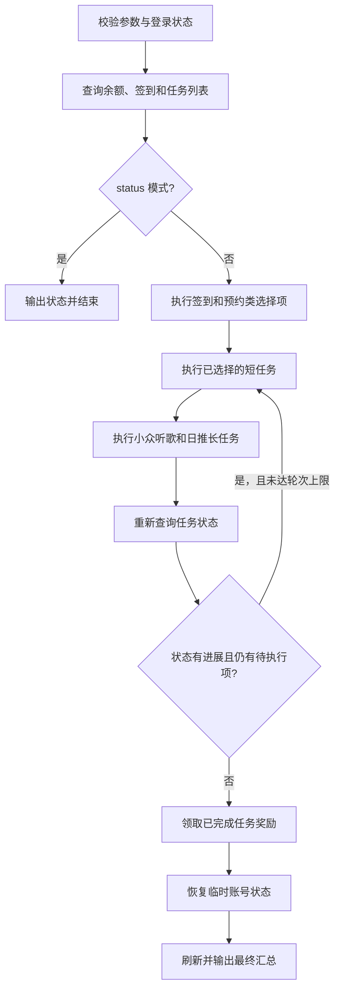

# PRD: ncmctl yunbei 云贝任务命令

- 最后更新: 2026-09-05
- 模块: ncmctl CLI、云贝 API（`internal/ncmctl`、`api/weapi`、`api/eapi`）

## 1. 背景与目标

当前 `ncmctl sign` 已支持云贝签到、连续签到奖励领取，以及在 `--automatic` 开启时领取已经完成的云贝任务奖励。但它不负责发现和完成云贝中心展示的日常任务，用户仍需在客户端逐项处理浏览、听歌、点赞、关注、收藏、分享等任务。

官方云贝规则说明：任务和奖励以云贝中心页面实时展示为准；完成任务或活动后，奖励通常需要在 24 小时内主动领取；分享任务需要分享到站外；通过欺诈、作弊或其他不正当方式获取云贝，可能导致奖励停发、扣回或账号能力受限。因此，新命令必须以服务端任务状态为事实来源，明确展示账号副作用和风险，不能把一次接口调用成功直接等同于任务完成。

本需求新增独立顶级命令 `ncmctl yunbei`，提供云贝签到、奖励领取、任务查询和任务执行的完整入口。现有 `sign` 命令暂不调整，两条命令允许存在签到和领奖能力重叠。

外部参考实现 `3899/ncmm` 已覆盖多种云贝任务，但存在硬编码任务、歌曲和歌手 ID，按中文任务名分发，直接使用 `time.Sleep`，失败后只打印不返回，以及部分协议选择与当前仓库不一致等问题。它只用于确认可能的业务流程和接口范围，不作为本仓库的实现规范。

### 1.1 目标

- 新增顶级命令 `ncmctl yunbei`，覆盖签到、连签奖励、云贝任务执行和任务奖励领取。
- 任务执行必须通过 `--task` 明确选择，或通过 `--all` 明确执行全部支持任务。
- 首个版本覆盖参考实现中的完整任务集，包括发布图文、站外分享和日推长时播放。
- 每个任务执行前读取服务端任务状态，执行后重新查询；只有服务端确认完成才报告成功。
- 点赞、关注、收藏和红心只操作尚未处理的目标，并在任务确认完成后恢复本次执行前的账号状态。
- 发布的图文默认保留，仅在用户显式传入 `--delete` 时删除本次运行创建的图文。
- 在编码前完成接口路径、加密模式、请求字段、响应字段和任务标识的对齐，不使用猜测值补齐协议。
- 复用当前仓库的 API Client、Cookie、日志、图片上传、动态发布和播放链路，不建立第二套会话或持久化机制。

### 1.2 非目标

- 不修改、迁移或删除现有 `ncmctl sign` 的任何行为。
- 不在首个版本中接入 `ncmctl task` 定时调度；本需求只新增可立即执行的顶级命令。
- 不增加参考仓库的多账号配置和批量账号执行能力。
- 不支持云贝提现、商品兑换、公益捐赠、推歌消费或其他消耗云贝的功能。
- 不自动参与翻卡、红包雨、宠粉节等规则和生命周期不固定的运营活动。
- 不绕过验证码、`checkToken`、反作弊校验或客户端要求的会话条件。
- 不保证每天出现固定任务、固定任务 ID、固定奖励数量或固定执行顺序。

## 2. 用户故事（User story）

### US-001: 按需完成云贝任务

**描述:** 用户只希望完成当天指定的云贝任务，不想让命令额外关注歌手、发布动态或执行长时间播放。

**验收标准:**

- [ ] `--task` 支持逗号分隔和重复传入，并对重复值去重。
- [ ] 只执行用户选择且服务端显示为待完成的任务。
- [ ] 未选择任务且未传 `--all` 时，在任何账号写操作前报错退出。
- [ ] 未知任务标识在参数校验阶段报错，不降级为 `--all`。

### US-002: 一次完成全部支持任务

**描述:** 用户愿意承担较长运行时间和账号状态变化，希望通过一次显式操作完成当天所有可支持任务并领取奖励。

**验收标准:**

- [ ] `ncmctl yunbei --all` 执行完整任务集。
- [ ] 命令开始前说明将发生的公开发布、点赞、关注、收藏、红心、分享和播放行为。
- [ ] 快任务先执行，听歌和日推长时播放后执行，避免长任务阻塞后续短任务。
- [ ] 单个任务失败后继续执行其他已选择任务，结束时以非零状态汇总失败。

### US-003: 查看当天状态而不修改账号

**描述:** 用户希望先查看余额、签到和任务状态，再决定执行哪些任务。

**验收标准:**

- [ ] `ncmctl yunbei status` 只调用查询接口。
- [ ] 输出云贝余额、签到状态、任务名称、任务标识、进度、奖励和领取状态。
- [ ] 查询模式不签到、不领奖、不上报任务进度，也不改变点赞、关注、收藏、红心或动态。

### US-004: 保留原有账号偏好

**描述:** 用户愿意临时完成点赞、关注、收藏和红心任务，但不希望命令破坏原有关系或收藏状态。

**验收标准:**

- [ ] 任务只选择当前未点赞、未关注、未收藏或未红心的目标。
- [ ] 服务端确认任务完成后，只撤销本次命令新增的状态。
- [ ] 恢复失败时输出目标 ID 和恢复动作，最终结果标记为部分成功并返回非零状态。
- [ ] 发布图文默认保留；`--delete` 只删除本次运行成功创建的图文。

### US-005: 准确判断任务是否完成

**描述:** 用户需要区分“请求已发送”和“任务已被云贝中心计入”，避免命令显示成功但实际没有奖励。

**验收标准:**

- [ ] 每轮执行后重新获取服务端任务状态。
- [ ] 分享任务只有在服务端任务进度确认后才显示完成。
- [ ] 接口成功但任务状态没有变化时显示未确认，不领取该任务奖励。
- [ ] 奖励接口返回成功后再次刷新领取状态，避免重复显示已领取。

## 3. 功能需求

### FR-01: [P0]-命令结构与参数校验

命令形式：

```text
ncmctl yunbei status
ncmctl yunbei --task sign --task claim
ncmctl yunbei --task reserve,listen-indie
ncmctl yunbei --task publish-note --title "今日音乐" --message "..." --image ./cover.jpg
ncmctl yunbei --all
ncmctl yunbei --all --delete
```

支持的任务标识：

| 标识 | 功能 |
| --- | --- |
| `sign` | 每日签到并领取当前可领取的连续签到奖励 |
| `claim` | 领取服务端显示为已完成且待领取的任务奖励 |
| `reserve` | 领取到期预约奖励，并预约下一期活动 |
| `view-vip-center` | 完成浏览会员中心任务 |
| `like-comment` | 点赞符合条件的评论，确认任务后恢复 |
| `listen-indie` | 完成探索小众歌曲任务 |
| `follow-artist` | 关注未关注歌手，确认任务后恢复 |
| `collect-song` | 收藏未收藏歌曲，确认任务后恢复 |
| `like-song` | 红心未红心歌曲，确认任务后恢复 |
| `publish-note` | 发布图文任务，默认保留本次图文 |
| `share-song` | 执行站外歌曲分享链路并确认任务进度 |
| `play-daily-recommend` | 按服务端进度完成日推长时播放任务 |

**规则边界限制**

- `--task` 使用稳定英文标识，不接受服务端中文任务名作为参数。
- `--all` 与 `--task` 互斥，同时提供时快速失败。
- 执行模式未提供 `--all` 或有效 `--task` 时快速失败。
- `status` 与所有写操作参数互斥。
- `--title`、`--message`、`--image` 和 `--delete` 仅在选择 `publish-note` 或 `--all` 时有效，否则快速失败。
- `--image` 必须是存在的常规非空文件，不接受目录或符号链接。
- `--message` 提供时去除首尾空白后不少于 10 个 Unicode 字符。
- 参数顺序不决定执行顺序；命令使用固定阶段顺序保证结果可复现。

### FR-02: [P0]-登录校验与状态查询

**业务流程**

1. 使用 `api.NewClient` 创建唯一客户端，并通过 `closeAPIClient` 关闭。
2. 使用 `weapi.GetUserInfo` 校验登录状态，输出昵称和 UID，不输出 Cookie 或会话令牌。
3. 查询云贝余额、签到状态、完整任务列表和待处理任务列表。
4. 将同一任务在不同接口中的数据按稳定标识关联，形成统一任务状态。

**状态说明**

- 任务状态至少区分：不可用、待执行、执行中、已完成待领取、已领取、未确认、失败。
- 任务名称和奖励以服务端返回为准，仅用于展示。
- 客户端任务分发优先使用 `missionCode`；`taskId`、`userTaskId` 用于关联和请求参数。
- 不能仅凭中文任务名选择写操作处理器。无法建立稳定映射时显示“不支持”，并跳过写操作。

### FR-03: [P0]-执行编排与收敛

整体流程：



**业务规则**

- 最多执行 3 轮；任务状态无变化时立即停止，避免固定空转或无限循环。
- 快任务包括预约、浏览、点赞、关注、收藏、红心、发布和分享。
- 慢任务包括探索小众歌曲和日推长时播放，始终放在快任务之后。
- 仅执行服务端当前存在、尚未完成且被用户选择的任务。
- 服务端当天未提供某个已选择任务时记为“今日不可用”，不算执行失败。
- 单个任务的网络或业务错误记录后继续；登录失效、初始任务列表不可用等全局前置错误立即终止。
- 命令结束时只要存在执行失败、状态未确认或恢复失败，就返回非零状态。

### FR-04: [P0]-签到、连签奖励和任务领奖

**签到流程**

1. 调用云贝中心签到接口。
2. 查询连续签到进度。
3. 只对服务端返回的可领取 `baseLotteryId` 或已对齐的额外奖励 ID 发起领取。
4. 领取后重新查询签到进度并输出结果。

**任务领奖流程**

1. 查询待处理任务列表。
2. 筛选服务端标记为已完成且尚待领取的记录。
3. 使用该记录返回的 `period`、`userTaskId` 和 `depositCode` 逐项领取。
4. 单项领取失败继续其他奖励，最终聚合错误。

**规则边界限制**

- 不根据奖励名称或预计云贝数量构造领奖参数。
- 不对未被服务端确认完成的任务调用领奖接口。
- 重复签到、奖励已领取等幂等状态以正常跳过展示，不作为命令失败。
- `sign` 命令保持原有请求顺序、输出和错误行为；共享逻辑只能在不改变其行为且有回归测试时抽取。

### FR-05: [P0]-预约领云贝

1. 查询当前预约活动状态和服务端 `reqId`。
2. 存在上一期已预约但未领取奖励时，先领取奖励。
3. 领取成功后重新查询活动状态。
4. 当前活动允许预约且尚未预约时，使用最新 `reqId` 完成预约。
5. 未知状态只展示，不通过字符串包含关系猜测写操作。

预约是独立活动，不依赖当天常规任务列表。服务端没有活动、活动已结束或已经预约时正常跳过。

### FR-06: [P0]-浏览会员中心

1. 从统一任务状态中取得当天任务的 `taskId`、`subAction`、`type` 和 `checkToken` 等服务端参数。
2. 调用任务点击接口开始任务。
3. 使用可响应 context 取消的等待模拟页面停留。
4. 重新查询任务状态确认进度。

禁止使用参考实现中的固定任务 ID `6758460`、固定 `subAction=weibo` 或固定 `type=feizhu`。必要字段缺失时，该任务标记为接口数据不足，不发起请求。

### FR-07: [P0]-评论点赞

1. 从任务链接或当天服务端推荐资源中选择评论区，不使用固定歌曲或线程 ID。
2. 获取评论后过滤本人评论、已点赞评论和无效评论。
3. 点赞满足条件的评论，按服务端任务目标控制数量。
4. 刷新任务状态；确认完成后撤销本次新增的点赞。

如果可用评论少于目标数量，处理现有目标并报告部分完成。撤销失败时保留评论 ID 供用户处理，但不输出评论内容或其他用户隐私数据。

### FR-08: [P0]-探索小众歌曲

1. 查询服务端推荐的小众歌曲和目标数量。
2. 获取歌曲详情，使用服务端返回的歌曲 ID 和专辑 ID。
3. 按已经对齐的接口顺序执行播放、分配或听歌进度上报。
4. 每首歌曲之间使用可取消的真实等待，持续时间以任务契约为准。
5. 每轮后刷新任务进度，达到服务端目标后停止。

不能固定发送 `yunbeiAmount=150`，除非抓包或上游协议证明确认该字段含义和值。不能因为推荐接口返回 10 首歌曲就假定当天目标恒为 10 首。

### FR-09: [P0]-关注歌手、收藏歌曲和红心歌曲

**共同规则**

- 从当天推荐或任务上下文动态选择目标，不使用固定周杰伦、固定《晴天》或固定歌单。
- 只选择当前未处于目标状态的对象，执行前记录原状态。
- 每次动作后检查业务响应，并重新查询云贝任务进度。
- 任务确认完成后恢复本次新增状态；原本已关注、已收藏或已红心的内容不得被取消。

**收藏歌曲补充规则**

- 仅使用当前账号拥有写权限的普通歌单。
- 添加前确认歌曲不在目标歌单中。
- 恢复时只移除本次成功添加的歌曲。

### FR-10: [P0]-发布图文

1. 从当天推荐歌曲或任务上下文选择内容来源。
2. `--image` 优先；未提供时下载所选歌曲封面到受控临时文件。
3. 标题和正文可由 `--title`、`--message` 覆盖；未提供时使用所选歌曲信息生成自然、可读且满足长度要求的内容。
4. 上传图片并发布图文，记录服务端返回的动态 ID。
5. 刷新云贝任务状态，只有服务端确认后报告完成。
6. 默认保留图文；`--delete` 开启时，在任务确认完成后删除本次发布的动态。

临时图片在所有退出路径清理。发布成功但任务未确认时不重复发布，输出动态 ID 并返回部分成功。删除失败不再次发布，结果标记为部分成功。

### FR-11: [P0]-站外分享歌曲

1. 从任务元数据或当天推荐中选择可用歌曲。
2. 使用与当天云贝任务一致的分享触发接口、渠道和协议模式。
3. 等待分享链路需要的最短时间后重新查询任务状态。
4. 只有云贝任务状态或进度发生预期变化才报告完成。

官方规则要求分享到站外。CLI 无法仅凭本地“模拟跳转”证明真实站外分享，因此：

- 不能把分享触发接口 `Code == 200` 当作完成依据。
- 不能使用乐迷团分享进度接口替代云贝任务接口，除非请求证据证明两者确实属于同一链路。
- 当前 `DailySongShareTrigger` 固定使用 XEAPI，而参考实现尝试使用 EAPI；加密模式、会话要求和渠道字段对齐前，该任务不得进入编码阶段。
- 服务端未确认任务完成时输出“分享已触发，任务未确认”，并返回非零状态。

### FR-12: [P0]-日推长时播放

1. 获取每日推荐歌曲，过滤当前用户自己的作品和不可播放内容。
2. 从服务端任务进度取得剩余目标；无法取得时不猜测固定数量。
3. 复用仓库现有的歌曲详情、`startplay` 上报、播放地址获取、受限音频读取和 `play` 上报链路。
4. 按真实经过时间累计任务时长，参考目标为 31～45 分钟，但以当天服务端任务要求为准。
5. 每首之间的等待必须响应 context 取消，并持续输出简洁进度。
6. 达到服务端目标或任务被确认完成后立即停止。

命令帮助必须说明该任务耗时和网络流量。取消时停止新播放、关闭响应体并保留已完成进度，不伪造剩余播放记录。

### FR-13: [P0]-等待、取消和账号状态恢复

- 所有等待复用一个 context-aware 辅助方法，不直接调用不可取消的 `time.Sleep`。
- 随机等待使用 `math/rand/v2`，区间集中定义为有名常量，暂不增加配置项。
- 收到取消信号后停止发起新的业务动作，并使用有界清理流程恢复本次点赞、关注、收藏和红心状态。
- 恢复顺序与写入顺序相反；只恢复记录为“本次新增成功”的动作。
- 清理超时或失败必须进入最终汇总，不能只写 debug 日志。

### FR-14: [P0]-输出和退出状态

每个任务输出以下信息：任务名称、选择状态、执行前进度、动作结果、执行后进度、奖励领取结果、恢复结果。

最终汇总至少区分：

- 成功：所选任务均由服务端确认完成，奖励和恢复操作成功。
- 跳过：当天未提供任务、任务已完成、奖励已领取或无符合条件的目标。
- 部分成功：业务动作成功但任务未确认、奖励失败、图文删除失败或临时状态恢复失败。
- 失败：登录失效、初始状态无法加载、任务动作全部失败或协议前置条件不足。

任何失败或部分成功均返回非零退出状态，便于脚本和未来调度识别。日志不得包含 Cookie、`checkToken`、XEAPI 会话密钥、完整加密载荷或本地凭据路径中的敏感内容。

## 4. 接口对齐结论与实现门槛

### 4.1 当前接口清单

| 能力 | 当前仓库接口/实现 | 结论 | 编码前需处理 |
| --- | --- | --- | --- |
| 登录校验 | `weapi.GetUserInfo`、`NeedLogin` | 已有 | 复用单一 Client 生命周期 |
| 云贝余额 | `weapi.YunBeiBalance`、`YunBeiUserInfo` | 已有 | 选定当前有效接口并固定展示字段 |
| 签到与连签奖励 | `YunBeiSignIn`、`YunBeiSignInProgress`、`YunBeiSignLottery` | 已有且被 `sign` 使用 | 保持 `sign` 行为不变，补充新命令离线顺序测试 |
| 常规任务列表 | `weapi.YunBeiTaskListV3` | 基本已有 | 将任务条目改为可复用命名类型；确认 `missionCode`、进度和动作参数字段 |
| 待处理/待领奖列表 | `eapi.YunBeiTaskTodo`、`weapi.YunBeiTaskTodo` | 已有但字段不完整 | EAPI 响应至少缺少参考实现使用的 `taskId`；核对是否还缺 `subAction`、`type`、`checkToken` |
| 任务领奖 | `weapi.YunBeiTaskFinish` | 已有 | 验证 `period`、`userTaskId`、`depositCode` 的来源和类型 |
| 预约活动 | `YunbeiReserveInfo`、`YunbeiReserveBooked`、`YunbeiReserveRewardReceive` | 已有 | 枚举服务端状态，不用模糊字符串匹配决定写操作 |
| 浏览任务 | `eapi.YunbeiClickTask` | 已有 | 从任务响应取得全部请求字段，禁止硬编码 |
| 评论点赞 | `weapi.Comments`、`CommentLike`、`CommentUnlike` | 已有 | 对齐动态评论资源来源和目标数量 |
| 小众歌曲 | `YunbeiDistributionRecommendSong`、`YunbeiDistributionCreate`、`TrialsongListen` | 已有 | 核对调用顺序、目标数量、等待要求和 `yunbeiAmount` 语义 |
| 关注歌手 | `ArtistHot`、`ArtistSub`、`ArtistUnsub` | 已有 | 确认查询关注状态和恢复结果的字段 |
| 收藏歌曲 | `Playlist`、`PlaylistAddOrDel` | 已有 | 确认歌单所有权、歌曲原状态和恢复结果 |
| 红心歌曲 | `DiscoveryRecommendSongs`、`SongLike` | 已有 | 确认歌曲原状态的数据来源 |
| 发布图文 | `EventUploadImage`、`EventPublish`、`EventDelete`，已有 `share`/`fansgroup` 编排 | 已有 | 复用内容校验、临时文件和发布结果处理 |
| 站外分享 | `DailySongShareTrigger`、`FansGroupMissionForwardProgress` | 协议未对齐 | 明确云贝任务专用路径、XEAPI/EAPI 模式、渠道、会话和进度确认接口 |
| 日推长时播放 | `RecommendSongs`、`SongDetail`、`SongPlayerV1`、`WebLog`，已有乐迷团播放链路 | 基础能力已有 | 对齐云贝时长进度字段和真实完成条件 |

### 4.2 编码准入条件

每一种任务在进入实现前必须具备以下证据：

1. 明确的接口 URL、HTTP 方法和 WEAPI/EAPI/XEAPI 模式。
2. 完整请求字段及来源，区分服务端动态值、协议默认值和用户参数。
3. 足以判断成功、已完成、待领取和失败的响应字段。
4. 服务端任务条目与本地任务标识之间的稳定映射。
5. 固定响应或 fake transport 测试，覆盖请求顺序、字段序列化、业务失败和取消。

参考仓库中的硬编码值、中文名称分支或自生成请求不能单独作为协议证据。缺少上述证据的任务仍可出现在 `status` 中，但执行时必须明确报告“接口未对齐”，不能静默尝试。

## 5. 产品方案

### 5.1 任务注册表

命令内部维护一份有限的任务注册表，每个条目包含公开任务标识、风险说明、服务端稳定标识、执行阶段和处理器。注册表负责参数校验和任务分发，服务端响应负责决定当天是否存在任务以及当前进度。

不采用纯中文任务名分发。服务端新增未知任务时，`status` 正常展示原始名称和标识，执行模式将其标记为暂不支持，不影响其他任务。

### 5.2 显式执行方案

| 方案 | 优点 | 缺点 | 结论 |
| --- | --- | --- | --- |
| 无参数执行全部任务 | 使用简单 | 容易意外发布、点赞或运行数十分钟 | 不采用 |
| 必须使用 `--task` 或 `--all` | 副作用明确，适合脚本审计 | 命令稍长 | 采用 |
| 通过配置文件隐式启用任务 | 适合多账号守护进程 | 引入新配置和状态来源，偏离当前单账号 CLI | 首版不采用 |

### 5.3 现有 `sign` 的兼容策略

`yunbei` 独立实现完整流程，但不得改变 `sign` 的现有输出、请求顺序、`--automatic` 语义和错误传播。确有重复且能用离线测试证明行为一致时，可在后续技术设计中抽取包内辅助函数；抽取不是本需求的产品目标，也不能成为新增命令的前置阻塞。

## 6. 非功能性需求

### 6.1 性能与资源

- 状态查询和短任务不应创建重复 API Client。
- 图片和音频下载必须流式处理并设置大小、超时和响应体关闭约束。
- 长时播放必须持续响应取消，不因进度输出造成日志刷屏。
- 最多 3 轮任务收敛，状态无变化时提前停止。

### 6.2 安全与账号风险

- 帮助文案必须明确列出账号写操作和官方风险规则。
- `--all`、发布、分享和长时播放均为用户显式选择，不从配置或历史状态偷偷启用。
- 不硬编码第三方用户、评论、歌曲、歌手、歌单、任务或活动 ID。
- 不输出 Cookie、令牌、请求签名、完整用户动态正文或其他敏感调试数据。
- 不伪造任务完成；最终状态始终以服务端重新查询为准。

### 6.3 兼容性

- 支持仓库 `go.mod` 声明的最低 Go 版本。
- 遵循现有 Cobra、日志、错误包装和 `api.Client` 生命周期。
- 保持 `ncmctl sign`、`task --sign` 和既有配置文件兼容。
- 新命令文档同步更新 `README.md`、`docs/usage.md` 和用户 Skill 命令参考。

### 6.4 可测试性

- 使用 fake `RoundTripper` 或 `httptest` 完成离线测试，不依赖真实账号。
- 每个任务至少覆盖：未出现、已完成、成功完成、业务失败、状态未确认、取消和恢复失败。
- 覆盖 `--task` 去重、未知标识、`--all` 冲突、`status` 只读和输出汇总。
- 真实 API、账号签到、发布、分享、点赞和播放测试只在用户明确授权后执行。

## 7. 验收指标

| 场景 ID | 验收点 | 前置条件（Given） | 触发动作（When） | 预期结果（Then） |
| --- | --- | --- | --- | --- |
| AC-001 | 未选择任务 | 已登录 | 执行 `ncmctl yunbei` | 在任何写请求前报错，提示使用 `--task` 或 `--all` |
| AC-002 | 只读查询 | 已登录且存在任务 | 执行 `ncmctl yunbei status` | 输出余额和任务状态，未发送写请求 |
| AC-003 | 指定任务 | 当天存在浏览任务 | 执行 `--task view-vip-center` | 只执行浏览任务并由刷新状态确认完成 |
| AC-004 | 全部任务 | 当天存在多种任务 | 执行 `--all` | 按固定阶段执行全部支持任务并输出汇总 |
| AC-005 | 当天无任务 | 用户选择的任务未出现 | 执行对应 `--task` | 显示今日不可用，正常跳过，不调用写接口 |
| AC-006 | 签到幂等 | 当天已签到 | 执行 `--task sign` | 显示已签到，继续检查可领取连签奖励 |
| AC-007 | 任务领奖 | 存在已完成待领取任务 | 执行 `--task claim` | 使用服务端返回参数逐项领取并刷新状态 |
| AC-008 | 临时状态恢复 | 目标原本未关注 | 执行 `--task follow-artist` | 确认任务后取消本次关注，原状态不变 |
| AC-009 | 保留原状态 | 候选歌曲已经红心 | 执行 `--task like-song` | 不选择该歌曲，不取消既有红心 |
| AC-010 | 图文默认保留 | 当天存在发布任务 | 执行 `--task publish-note` | 发布一次，确认任务完成并保留动态 |
| AC-011 | 显式删除图文 | 当天存在发布任务 | 执行 `--task publish-note --delete` | 确认任务后只删除本次动态 |
| AC-012 | 分享未确认 | 分享触发接口成功但任务进度未变化 | 执行 `--task share-song` | 显示未确认，拒绝领奖并返回非零状态 |
| AC-013 | 长任务取消 | 日推播放执行中 | 用户发送取消信号 | 停止新请求、关闭资源、恢复临时状态并返回非零状态 |
| AC-014 | 部分失败 | 多个任务中一个失败 | 执行 `--all` | 继续其他任务，最终汇总失败并返回非零状态 |
| AC-015 | 未知服务端任务 | 服务端新增本地未知任务 | 执行 `status` 或 `--all` | 状态模式展示；执行模式标记不支持且不猜测处理器 |

## 8. 风险与待决事项

### 8.1 实现前必须关闭

- [ ] 核对任务列表、待办列表之间的关联键和 `missionCode` 稳定性。
- [ ] 补齐 `eapi.YunBeiTaskTodoRespData.TaskId`，并确认浏览/分享需要的其他动作字段。
- [ ] 确认连续签到额外奖励 `ExtraLotteryId` 的领取接口和状态语义。
- [ ] 确认小众歌曲任务中 `YunbeiDistributionCreate` 的字段含义、调用顺序和目标数量。
- [ ] 确认分享任务实际使用的接口、渠道和加密模式；当前 XEAPI 实现与参考实现不一致。
- [ ] 确认日推任务的剩余时长/进度字段，避免固定播放 31～45 分钟仍无法完成当天任务。
- [ ] 确认发布图文、分享歌曲完成后对应任务状态的刷新延迟和可领取时点。

### 8.2 产品与运行风险

- 官方任务、奖励和接口可能随运营活动变化，未知任务必须安全跳过。
- 自动点赞、关注、收藏、红心、发布和分享可能触发风控；即使恢复状态，也不能承诺消除风险。
- 奖励领取存在有效期，网络失败或任务未确认可能导致错过领取。
- 发布图文属于公开账号内容；`--all` 会明确包含此行为。
- 日推长时播放会显著增加运行时间和网络流量。
- 未经真实账号验证，离线测试只能证明编排、序列化和错误处理，不能证明上游实际计入任务。

## 9. 参考

### 9.1 术语与定义

| 名词 | 说明 |
| --- | --- |
| 云贝任务 | 云贝中心当天展示的签到、浏览、听歌、互动等获取云贝任务 |
| 连签奖励 | 达到连续签到天数后单独领取的阶段奖励 |
| 任务奖励 | 云贝任务完成后，通过任务领奖接口领取的云贝 |
| 任务确认 | 执行动作后重新查询服务端，确认任务状态或进度达到目标 |
| 状态恢复 | 撤销本次命令新增的点赞、关注、收藏或红心，不影响执行前已有状态 |

### 9.2 参考文档

- [云贝规则](https://y.music.163.com/g/yida/886846b41d264b51b4b835acfb0eb830?fromRN=1)：官方云贝获取、领取有效期、使用和风险规则。
- [3899/ncmm 云贝任务参考实现](https://github.com/3899/ncmm/blob/main/internal/ncmm/yunbei_tasks.go)：任务种类与流程参考，不作为代码风格或协议事实源。
- `internal/ncmctl/sign.go`：现有云贝签到、连签奖励和任务领奖逻辑。
- `api/weapi/yunbei.go`、`api/eapi/yunbei.go`：当前云贝 API 类型与端点。
- `internal/ncmctl/share.go`、`internal/ncmctl/fansgroup.go`：现有图片发布、分享和播放链路。
