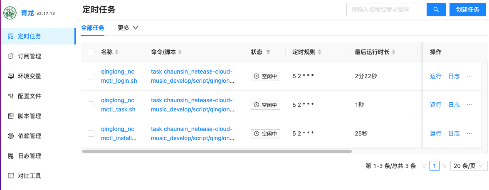
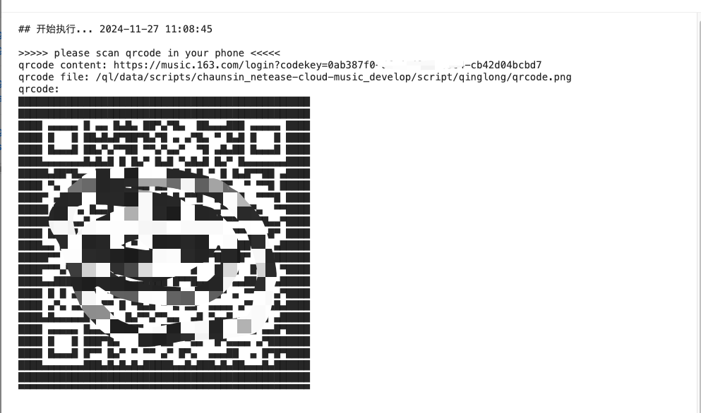

# 在青龙(qinglong)中运行

思路是，在青龙容器中安装`ncmctl`二进制包，利用青龙的拉取命令或订阅功能，拉取本仓库源码，添加cron定时任务，并定时运行相应的Task。

## 1. 准备工作

### 1.1 什么是青龙(qinglong)面板

[青龙面板](https://github.com/whyour/qinglong) 是一个定时任务管理面板，可以定时执行各种任务，比如定时更新订阅，定时执行脚本，定时执行命令等。

在实际场景中广泛用于自动化任务调度和脚本运行管理，特别是在与电商相关的自动化脚本领域（如京东签到、淘宝任务等）。

### 1.2 安装青龙(qinglong)面板

需提前安装好青龙面板工具,如果没安装则移步参考官方安装教程 [青龙面板安装](https://github.com/whyour/qinglong)。

本人安装的版本为`2.17.12`

如果已经安装则跳过此步骤。

## 2. 安装

### 2.1 在青龙面板中添加拉库定时任务

两种方式，任选其一即可：

#### 2.1.1 方式一：订阅管理

在`订阅管理`管理导航栏中，右上角`创建订阅`，填入以下信息：

```text
名称：ncmctl
类型：公开仓库
链接：https://github.com/chaunsin/netease-cloud-music.git
定时类型：interval
定时规则：1天
白名单：qinglong_ncmctl_
文件后缀：sh
```

定时规则可根据自己得需求进行设置，没提到的最好不要动除非你知道你在干什么。

保存后，点击`运行`按钮，运行拉库,并注意运行状态及日志，如果拉库成功，会自动添加ncmctl相关的task任务。

#### 2.1.2 方式二：定时任务拉库

打开青龙面板，`定时任务`页，右上角`创建任务`，填入以下信息：

```text
名称：拉取ncmctl库
命令：ql repo https://github.com/chaunsin/netease-cloud-music.git "qinglong_ncmctl_"
定时规则：0 10 * * *
```

保存后，点击`运行`按钮，运行拉库,并注意运行状态及日志，如果拉库成功，会自动添加ncmctl相关的task任务。

### 2.2 检查定时任务

如果正常，拉库成功后，会自动添加ncmctl相关的task任务。



### 2.3 安装ncmctl

首次添加需要手动安装ncmctl,不然需要定时任务时间到了才会去安装。

在青龙面板中，`定时任务`页，找到`ncmctl安装`脚本，并点击`运行`。需要注意安装是否成功。


### 2.3 登录

在青龙定时任务中，点击运行`ncmctl扫码登录`任务，查看运行日志，扫描日志中的二维码进行登录。



**提示:** 使用手机登录网易云音乐app进行扫码授权登录，如果不能识别终端打印的二维码可根据终端输出得文件路径提示找到二维码图片进行扫描,或者copy终端输出得
`qrcode content: https://www.163.com/xxx` 内容自己生成二维码再进行扫描(_粘贴时不要包含`qrcode content: `
以及结尾空格_)。扫描有时效性,默认超时时间为5分钟,另外扫码过程中
**不能退出**!!! 如有问题可重复此流程,为避免被风控不要频繁登录。

在线生成二维码工具: https://www.bejson.com/convert/qrcode/#google_vignette

## 3. 常见问题

### 3.1 github访问失败超时等问题

拉库时，受到国内网络限制影响，访问GitHub速度慢或者错误，可在仓库地址前加上代理进行加速访问。

如：

```text
https://ghproxy.cn/https://github.com/chaunsin/netease-cloud-music.git
https://ghproxy.cc/https://github.com/chaunsin/netease-cloud-music.git
https://ghproxy.net/https://github.com/chaunsin/netease-cloud-music.git
https://github.moeyy.xyz/https://github.com/chaunsin/netease-cloud-music.git
```

加速代理地址通常不能保证长期有效，请自行查找或参考以下使用。

https://github.com/hunshcn/gh-proxy/issues/116

### 3.2 not found command 错误

通常情况下在首次安装时会出现此问题,原因是没有先执行`ncmctl安装`任务。先执行此任务然后在尝试登录、一键任务等其他操作做。

如果碰到以下错误：

```text
inglong_ncmctl_install.sh: line 127: /usr/local/bin/ncmctl: cannot execute: required file not found
qinglong_ncmctl_install.sh: line 252: pop_var_context: head of shell_variables not a function context
/ql/shell/otask.sh: line 286: pop_var_context: head of shell_variables not a function context
```

这个错误可能是`ncmctl`命令不能正确执行,对应得命令可能不适配当前的系统架构或者版本、或脚本有问题, 可进入到青龙部署所在的服务器内查看
`ncmctl`命令是否存在、能否正常运行。
